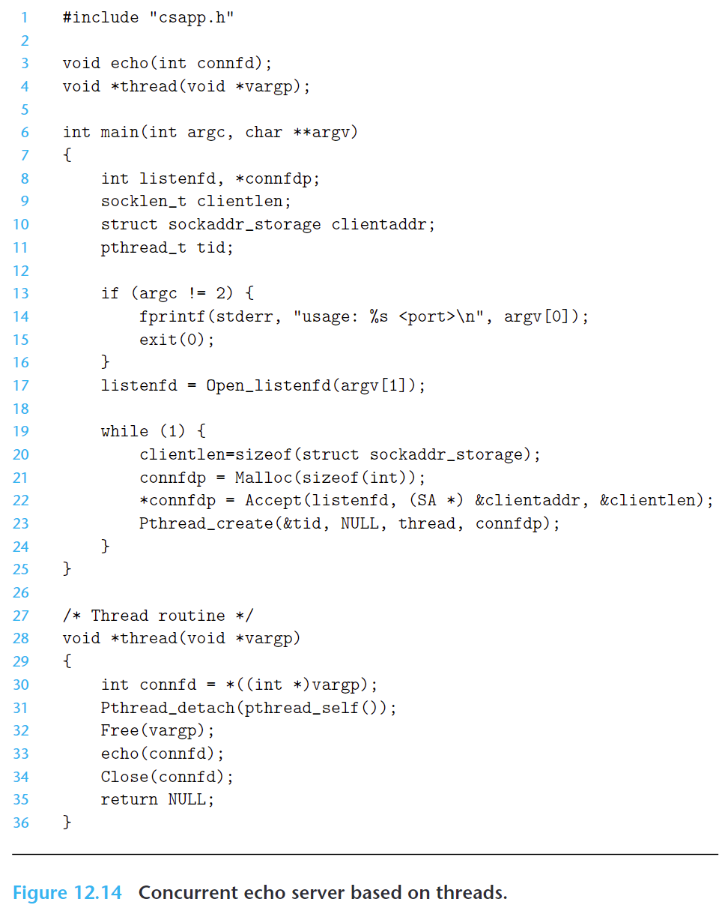
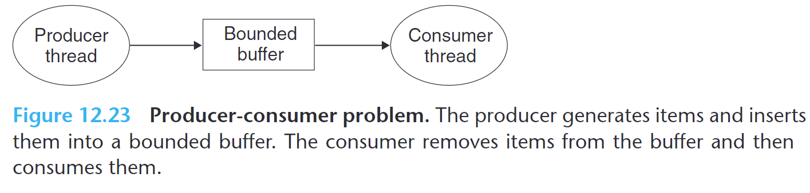
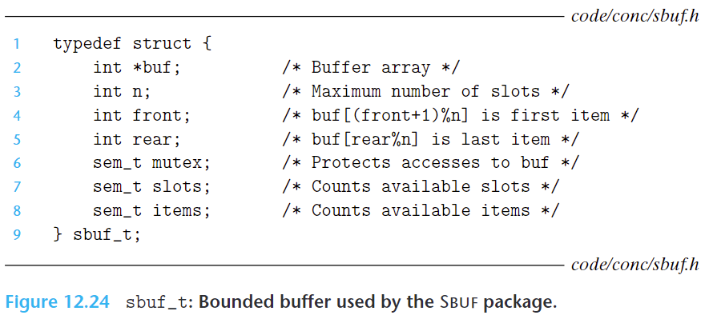
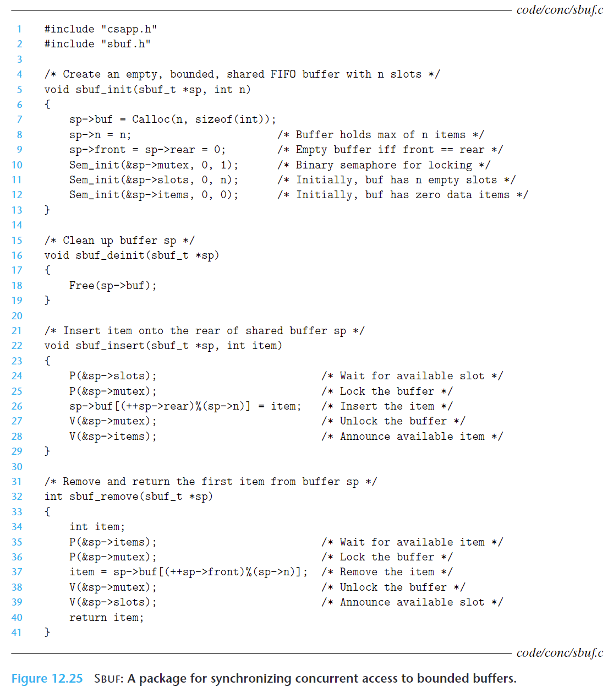
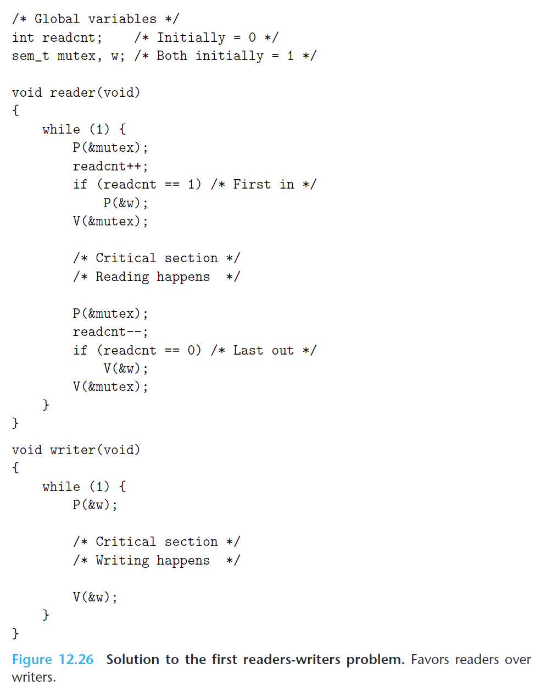
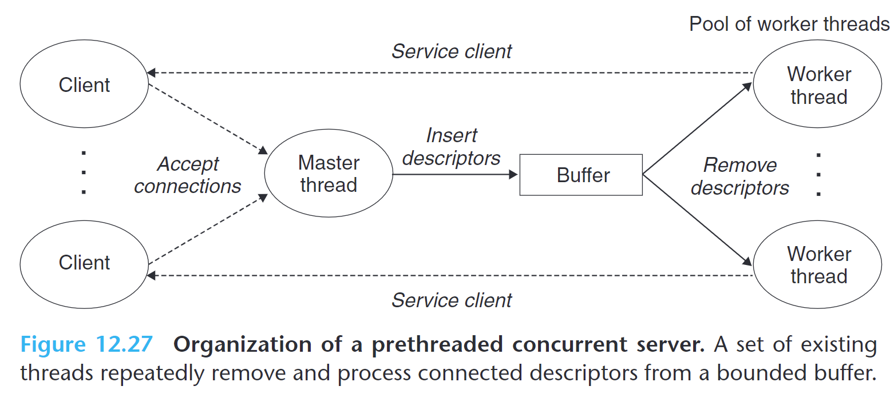

深入理解计算机系统——第十二章 Concurrent Programming  
  
  
资源：  
> [视频课程](https://www.bilibili.com/video/BV1iW411d7hd?p=23)  
  
# 12.1 Concurrent Programming with Processes  
The simplest way to build a concurrent program is with processes, using familiar functions such as fork, exec, and waitpid.   
  
例如搭建一个并发的服务器提供服务，当接收一个客户端的连接请求后，创建一个子进程来处理该客户端的连接，然后继续监听其他客户端的连接请求，如果后续又有客户端建立连接，再创建一个新的子进程来处理新客户端的连接  
  
  
  
  
# 12.2 Concurrent Programming with I/O Multiplexing  
假如服务器要处理两个独立的 I/O 事件：客户端连接请求和用户键盘输入命令，则可以通过 I/O 复用来实现  
  
I/O复用（I/O Multiplexing）是一种机制，允许一个进程或线程同时监控多个I/O操作，而无需阻塞或轮询每个I/O操作  
  
例如通过 select 函数来实现 I/O 复用：  
```cpp  
#include <sys/select.h>  
int select(int n, fd_set *fdset, NULL, NULL, NULL);  
//Returns: nonzero count of ready descriptors, −1 on error  
  
//Macros for manipulating descriptor sets  
FD_ZERO(fd_set *fdset); /* Clear all bits in fdset */  
FD_CLR(int fd, fd_set *fdset); /* Clear bit fd in fdset */  
FD_SET(int fd, fd_set *fdset); /* Turn on bit fd in fdset */  
FD_ISSET(int fd, fd_set *fdset); /* Is bit fd in fdset on? */  
```  
  
select 函数的第二个输入参数中 fd_set 是描述符集合（descriptor set），类似一个 bit vector of size n：  
$b_{n-1},...,b_{1},b_{0}$  
如果描述符 k 是该描述符集合的成员，则 $b_{k}$ 为 1  
通过 `the FD_ZERO, FD_SET, FD_CLR, and FD_ISSET` 这些宏来设置这种类型变量的值或做其他操作  
该集合被称为 read set，即读取集合  
  
select 函数的第一个参数 n 为描述符集合的基数  
  
select 函数使用读取集合来指定要监视的描述符，并阻塞等待至少一个描述符准备好进行读取操作。  
然后 select 函数会修改读取集合，将准备好进行读取操作的描述符放入准备集合（ready set），并返回准备集合的基数。  
为了正确使用 select 函数，每次调用前都需要更新读取集合，以确保包含需要监视的描述符。  
  
  
  
见上面示例，将连接客户端的描述符和接收标准输入的描述符都加入 read set 中  
然后通过 FD_ISSET 判断哪个描述符处于 ready set 集合中，如果在该集合，则处理对应的事件  
  
上面程序的缺点：  
If you type a command to standard input, you will not get a response until the server is finished with the client.   
A better approach would be to multiplex at a finer granularity, echoing (at most) one text line each time through the server loop.  
  
## 12.2.1 A Concurrent Event-Driven Server Based on I/O Multiplexing  
I/O multiplexing can be used as the basis for concurrent event-driven programs, where flows make progress as a result of certain events.   
  
The general idea is to model logical flows as state machines.   
  
Informally, a state machine is a collection of states, input events, and transitions that map states and input events to states.   
Each transition maps an (input state, input event) pair to an output state.  
A self-loop is a transition between the same input and output state.   
A state machine begins execution in some initial state. Each input event triggers a transition from the current state  
to the next state.  
  
## 12.2.2 Pros and Cons of I/O Multiplexing  
基于 I/O 复用的事件驱动程序有如下优点和缺点：  
  
优点：  
- The event-driven designs give programmers more control over the behavior of their programs than process-based designs  
- 运行在单个进程，不同的逻辑流共享一个地址空间  
- 效率更高，因为不需要上下文切换和调度  
  
缺点：  
- 代码复杂性增加  
The complexity increases as the granularity of the concurrency decreases.  
By granularity, we mean the number of instructions that each logical flow executes per time slice.  
如果一个逻辑流需要读一整行文本，在读取过程中，其他逻辑流处于阻塞过程，此时如果某个客户端仅发送部分文本然后停止操作，则该进程一直处于阻塞状态  
  
- 不能充分利用多核处理器  
  
  
# 12.3 Concurrent Programming with Threads  
A thread is a logical flow that runs in the context of a process.  
  
Each thread has its own thread context, including a unique integer thread ID (TID), stack, stack pointer, program counter, general-purpose registers, and condition codes.   
  
All threads running in a process share the entire virtual address space of that process.  
  
Like flows based on I/O multiplexing, multiple threads run in the context of a single process, and thus they share the entire contents of the process virtual address space, including its code, data, heap, shared libraries, and open files.  
  
## 12.3.1 Thread Execution Model  
线程不像进程有父子关系，线程之间是平等的  
  
  
  
  
## 12.3.2 Posix Threads  
Posix threads (Pthreads) is a standard interface for manipulating threads from C programs.   
  
## 12.3.3 Creating Threads  
The code and local data for a thread are encapsulated in a `thread routine`.  
线程例程是一个函数或方法，用于定义线程的行为和执行逻辑。它包含了线程的代码逻辑以及线程所需的本地数据。  
线程例程定义了线程在执行过程中要执行的操作和任务。  
线程例程的封装方式可以是将代码和本地数据放在同一个函数或方法中，也可以是将代码和本地数据作为线程对象的成员变量。  
无论具体的实现方式如何，线程例程的目的是将线程的执行逻辑和相关的数据封装在一起，以便线程可以独立地执行，并且可以方便地传递和共享数据。  
  
  
  
The pthread_create function creates a new thread and runs the thread routine `f` in the context of the new thread and with an input argument of `arg`.  
  
The `attr` argument can be used to change the default attributes of the newly created thread.  
  
When `pthread_create` returns, argument `tid` contains the ID of the newly created thread.  
  
示例如下：  
  
  
  
The new thread can determine its own thread ID by calling the `pthread_self` function.  
```cpp  
#include <pthread.h>  
pthread_t pthread_self(void);  
// Returns: thread ID of caller  
```  
  
## 12.3.4 Terminating Threads  
下面几种情况会造成线程终止：  
- The thread terminates implicitly when its top-level thread routine returns.  
- The thread terminates explicitly by calling the pthread_exit function.  
If the `main thread` calls `pthread_exit`, it waits for all other peer threads to terminate and then terminates the main thread and the entire process with a return value of thread_return.  
  
```cpp  
#include <pthread.h>  
void pthread_exit(void *thread_return);  
// Never returns  
```  
- Some peer thread calls the Linux exit function, which terminates the process and all threads associated with the process.  
- Another peer thread terminates the current thread by calling the `pthread_cancel` function with the ID of the current thread.  
```cpp  
#include <pthread.h>  
int pthread_cancel(pthread_t tid);  
// Returns: 0 if OK, nonzero on error  
```  
  
## 12.3.5 Reaping Terminated Threads  
Threads wait for other threads to terminate by calling the `pthread_join` function.  
```cpp  
#include <pthread.h>  
int pthread_join(pthread_t tid, void **thread_return);  
//Returns: 0 if OK, nonzero on error  
```  
  
The `pthread_join` function **blocks** until thread `tid` terminates, assigns the generic (void *) pointer returned by the thread routine to the location pointed to by `thread_return`, and then **reaps** any memory resources held by the terminated thread.  
  
## 12.3.6 Detaching Threads  
At any point in time, a thread is **joinable** or **detached**.   
  
A **joinable** thread can be **reaped** and **killed** by other threads.   
Its memory resources (such as the stack) are not freed until it is reaped by another thread.   
  
In contrast, a **detached** thread cannot be **reaped** or **killed** by other threads.   
Its memory resources are freed automatically by the system when it terminates.  
  
By default, threads are created joinable.   
  
In order to avoid memory leaks, each joinable thread should be either explicitly reaped by another thread or detached by a call to the `pthread_detach` function.  
  
```cpp  
#include <pthread.h>  
int pthread_detach(pthread_t tid);  
//Returns: 0 if OK, nonzero on error  
```  
Threads can detach themselves by calling pthread_detach with an argument of pthread_ self()  
  
## 12.3.7 Initializing Threads  
```cpp  
#include <pthread.h>  
pthread_once_t once_control = PTHREAD_ONCE_INIT;  
int pthread_once(pthread_once_t *once_control, void (*init_routine)(void));  
//Always returns 0  
```  
  
The `once_control` variable is a global or static variable that is always initialized to `PTHREAD_ONCE_INIT`.   
  
The first time you call `pthread_once` with an argument of `once_control`, it invokes `init_routine`, which is a function with no input arguments that returns nothing.   
  
Subsequent calls to pthread_once with the same `once_control` variable do nothing.   
  
The `pthread_once` function is useful whenever you need to dynamically initialize global variables that are shared by  
multiple threads.   
  
  
********  
`pthread_once`函数和线程创建函数（如`pthread_create`）之间存在以下区别：  
  
1. 功能不同：`pthread_once`函数用于实现只执行一次的初始化操作，通常用于初始化某个全局变量或执行一次性的资源分配。而线程创建函数（如`pthread_create`）用于创建新的线程，使得新线程可以执行指定的线程例程。  
  
2. 调用方式不同：`pthread_once`函数是通过在单个线程中调用来保证其中的代码只执行一次。通常，它是在应用程序初始化过程中的某个地方调用，以确保初始化代码只被执行一次。而线程创建函数（如`pthread_create`）是由一个线程调用，用于创建新的线程。  
  
3. 返回值不同：`pthread_once`函数的返回值是一个整数，用于指示初始化操作是否成功执行。线程创建函数（如`pthread_create`）的返回值是一个整数，表示线程创建的结果，成功时返回0，错误时返回相应的错误码。  
  
4. 使用场景不同：`pthread_once`函数通常用于初始化全局变量或执行一次性的资源分配，以确保这些操作只执行一次。而线程创建函数（如`pthread_create`）用于创建新的线程，用于并发执行不同的任务或逻辑。  
  
总的来说，`pthread_once`函数和线程创建函数（如`pthread_create`）具有不同的功能和用途。`pthread_once`函数用于实现只执行一次的初始化操作，而线程创建函数用于创建新的线程，使得新线程可以并发执行指定的任务或逻辑。  
  
## 12.3.8 A Concurrent Server Based on Threads  
示例如下：  
  
  
  
  
In order to avoid the potentially deadly race, we must assign each connected descriptor returned by accept to its own dynamically allocated memory block, as shown in lines 21–22.  
  
具体分析见书中描述，分析不恰当的代码可能造成死锁，以及避免内存泄漏  
  
# 12.4 Shared Variables in Threaded Programs  
## 12.4.1 Threads Memory Model  
A pool of concurrent threads runs in the context of a process.   
Each thread has its own separate thread context, which includes a thread ID, stack, stack pointer, program counter, condition codes, and general-purpose register values.  
Each thread shares the rest of the process context with the other threads.  
  
## 12.4.2 Mapping Variables to Memory  
Variables in threaded C programs are mapped to virtual memory according to their storage classes:  
- Global variables  
被所有线程共享  
- Local automatic variables  
A local automatic variable is one that is declared inside a function without the static attribute.  
每个线程独有，线程自己的栈中  
- Local static variables  
所有线程共享  
  
## 12.4.3 Shared Variables  
We say that a variable v is shared if and only if one of its instances is referenced by more than one thread.   
  
# 12.5 Synchronizing Threads with Semaphores  
  
## 12.5.1 Progress Graphs  
A progress graph models the execution of n concurrent threads as a trajectory through an n-dimensional Cartesian space.   
  
## 12.5.2 Semaphores  
A semaphore, s, is a global variable with a nonnegative integer value that can only be manipulated by two special operations, called P and V.  
  
Semaphores provide a convenient way to ensure mutually exclusive access to shared variables.  
  
P 操作和 V 操作是原子操作  
  
- P  
当一个进程要访问共享资源时，检查信号量的值是否大于 0，是则将值减 1，然后继续访问资源；  
如果信号量为 0，则将进程进入 sleep 状态，等待其他进程释放资源  
- V  
当一个进程使用完共享资源后，执行 V 操作，将信号量的值加 1  
如果此时有其他进程处于 sleep 状态在等待该信号量资源，则选择其中一个唤醒，使其可以执行 V 操作  
  
  
信号量操作函数：  
```cpp  
#include <semaphore.h>  
int sem_init(sem_t *sem, 0, unsigned int value);  
int sem_wait(sem_t *s); /* P(s) */  
int sem_post(sem_t *s); /* V(s) */  
//Returns: 0 if OK, −1 on error  
```  
  
信号量使用前必须初始化，表明可用资源的数量  
  
wrapper 函数：  
```cpp  
#include "csapp.h"  
void P(sem_t *s); /* Wrapper function for sem_wait */  
void V(sem_t *s); /* Wrapper function for sem_post */  
//Returns: nothing  
```  
  
## 12.5.3 Using Semaphores for Mutual Exclusion  
如果将一个信号量初始值设为 1，则表示该信号量不能共享，这种信号量称为 binary semaphore，即其值只能为 0 和 1  
  
binary semaphore 可用用来提供互斥锁（mutex）  
  
对 mutex 执行 P 操作即为 locking the mutex  
对 mutex 执行 V 操作即为 unlocking the mutex  
一个线程 locking 但没有 unlocking a mutex 称为 holding the mutex  
  
A semaphore that is used as a counter for a set of available resources is called a counting semaphore.  
  
## 12.5.4 Using Semaphores to Schedule Shared Resources  
  
### Producer-Consumer Problem  
生产者和消费者共享一个有限的 buffer，生产者复制向 buffer 中加入数据，消费者从 buffer 中移除数据  
当 buffer 满了，生产者必须等待直到消费者消费 buffer 中的数据  
当 bufffer 为空，消费者必须等待直到生产者生产数据  
  
  
  
  
代码：  
  
  
  
  
### Readers-Writers Problem  
  
  
  
## 12.5.5 Putting It Together: A Concurrent Server Based on Prethreading  
  
  
  
# 12.6 Using Threads for Parallelism  
见书中程序示例  
  
# 12.7 Other Concurrency Issues  
  
## 12.7.1 Thread Safety  
A function is said to be thread-safe if and only if it will always produce correct results when called repeatedly from multiple concurrent threads.   
