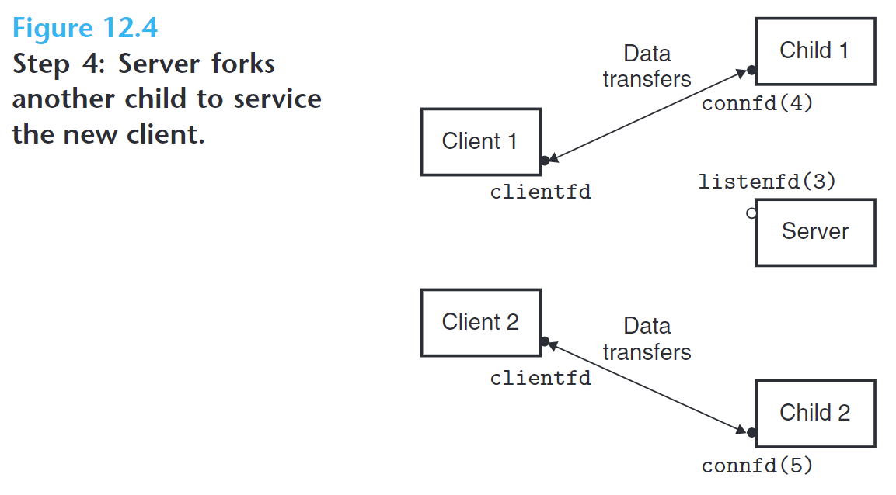
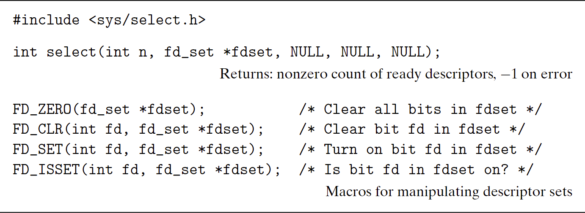
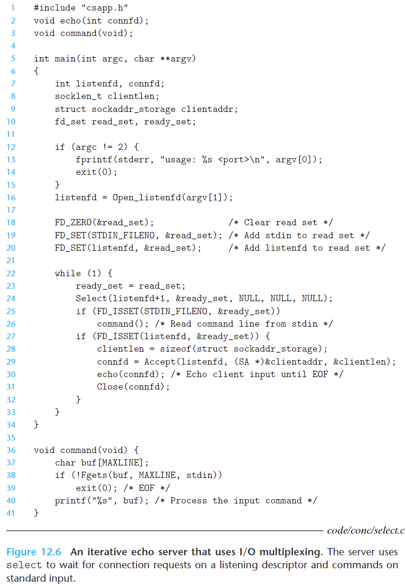
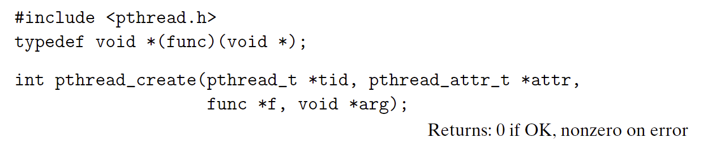
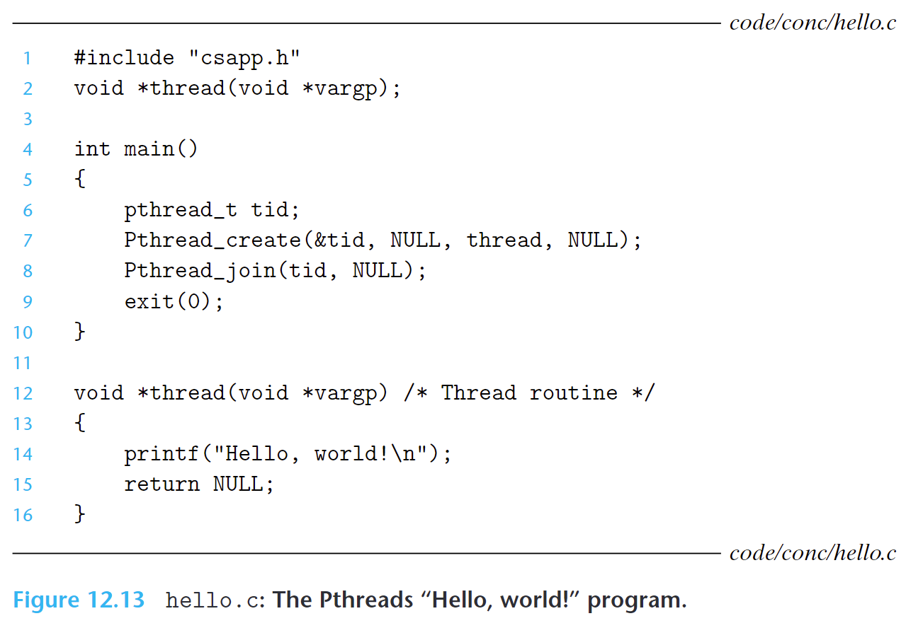

深入理解计算机系统——第十二章 Concurrent Programming


资源：
> [视频课程](https://www.bilibili.com/video/BV1iW411d7hd?p=23)

# 12.1 Concurrent Programming with Processes
The simplest way to build a concurrent program is with processes, using familiar functions such as fork, exec, and waitpid. 

例如搭建一个并发的服务器提供服务，当接收一个客户端的连接请求后，创建一个子进程来处理该客户端的连接，然后继续监听其他客户端的连接请求，如果后续又有客户端建立连接，再创建一个新的子进程来处理新客户端的连接




# 12.2 Concurrent Programming with I/O Multiplexing
假如服务器要处理两个独立的 I/O 事件：客户端连接请求和用户键盘输入命令，则可以通过 I/O 复用来实现

I/O复用（I/O Multiplexing）是一种机制，允许一个进程或线程同时监控多个I/O操作，而无需阻塞或轮询每个I/O操作

例如通过 select 函数来实现 I/O 复用：



select 函数的第二个输入参数中 fd_set 是描述符集合（descriptor set），类似一个 bit vector of size n：
$b_{n-1},...,b_{1},b_{0}$
如果描述符 k 是该描述符集合的成员，则 $b_{k}$ 为 1
通过 `the FD_ZERO, FD_SET, FD_CLR, and FD_ISSET` 这些宏来设置这种类型变量的值或做其他操作
该集合被称为 read set，即读取集合

select 函数的第一个参数 n 为描述符集合的基数

select 函数使用读取集合来指定要监视的描述符，并阻塞等待至少一个描述符准备好进行读取操作。
然后 select 函数会修改读取集合，将准备好进行读取操作的描述符放入准备集合（ready set），并返回准备集合的基数。
为了正确使用 select 函数，每次调用前都需要更新读取集合，以确保包含需要监视的描述符。



见上面示例，将连接客户端的描述符和接收标准输入的描述符都加入 read set 中
然后通过 FD_ISSET 判断哪个描述符处于 ready set 集合中，如果在该集合，则处理对应的事件

上面程序的缺点：
If you type a command to standard input, you will not get a response until the server is finished with the client. 
A better approach would be to multiplex at a finer granularity, echoing (at most) one text line each time through the server loop.

## 12.2.1 A Concurrent Event-Driven Server Based on I/O Multiplexing
I/O multiplexing can be used as the basis for concurrent event-driven programs, where flows make progress as a result of certain events. 

The general idea is to model logical flows as state machines. 

Informally, a state machine is a collection of states, input events, and transitions that map states and input events to states. 
Each transition maps an (input state, input event) pair to an output state.
A self-loop is a transition between the same input and output state. 
A state machine begins execution in some initial state. Each input event triggers a transition from the current state
to the next state.

## 12.2.2 Pros and Cons of I/O Multiplexing
基于 I/O 复用的事件驱动程序有如下优点和缺点：

优点：
- The event-driven designs give programmers more control over the behavior of their programs than process-based designs
- 运行在单个进程，不同的逻辑流共享一个地址空间
- 效率更高，因为不需要上下文切换和调度

缺点：
- 代码复杂性增加
The complexity increases as the granularity of the concurrency decreases.
By granularity, we mean the number of instructions that each logical flow executes per time slice.
如果一个逻辑流需要读一整行文本，在读取过程中，其他逻辑流处于阻塞过程，此时如果某个客户端仅发送部分文本然后停止操作，则该进程一直处于阻塞状态

- 不能充分利用多核处理器


# 12.3 Concurrent Programming with Threads
A thread is a logical flow that runs in the context of a process.

Each thread has its own thread context, including a unique integer thread ID (TID), stack, stack pointer, program counter, general-purpose registers, and condition codes. 

All threads running in a process share the entire virtual address space of that process.

Like flows based on I/O multiplexing, multiple threads run in the context of a single process, and thus they share the entire contents of the process virtual address space, including its code, data, heap, shared libraries, and open files.

## 12.3.1 Thread Execution Model
线程不像进程有父子关系，线程之间是平等的


## 12.3.2 Posix Threads
Posix threads (Pthreads) is a standard interface for manipulating threads from C programs. 

## 12.3.3 Creating Threads
The code and local data for a thread are encapsulated in a `thread routine`.
线程例程是一个函数或方法，用于定义线程的行为和执行逻辑。它包含了线程的代码逻辑以及线程所需的本地数据。
线程例程定义了线程在执行过程中要执行的操作和任务。
线程例程的封装方式可以是将代码和本地数据放在同一个函数或方法中，也可以是将代码和本地数据作为线程对象的成员变量。
无论具体的实现方式如何，线程例程的目的是将线程的执行逻辑和相关的数据封装在一起，以便线程可以独立地执行，并且可以方便地传递和共享数据。



The pthread_create function creates a new thread and runs the thread routine `f` in the context of the new thread and with an input argument of `arg`.

The `attr` argument can be used to change the default attributes of the newly created thread.

When `pthread_create` returns, argument `tid` contains the ID of the newly created thread.

示例如下：



The new thread can determine its own thread ID by calling the `pthread_self` function.
```cpp
#include <pthread.h>
pthread_t pthread_self(void);
// Returns: thread ID of caller
```

## 12.3.4 Terminating Threads
下面几种情况会造成线程终止：
- The thread terminates implicitly when its top-level thread routine returns.
- The thread terminates explicitly by calling the pthread_exit function.
If the `main thread` calls `pthread_exit`, it waits for all other peer threads to terminate and then terminates the main thread and the entire process with a return value of thread_return.

```cpp
#include <pthread.h>
void pthread_exit(void *thread_return);
// Never returns
```
- Some peer thread calls the Linux exit function, which terminates the process and all threads associated with the process.
- Another peer thread terminates the current thread by calling the `pthread_cancel` function with the ID of the current thread.
```cpp
#include <pthread.h>
int pthread_cancel(pthread_t tid);
// Returns: 0 if OK, nonzero on error
```

## 12.3.5 Reaping Terminated Threads
Threads wait for other threads to terminate by calling the `pthread_join` function.
```cpp
#include <pthread.h>
int pthread_join(pthread_t tid, void **thread_return);
//Returns: 0 if OK, nonzero on error
```

The `pthread_join` function **blocks** until thread `tid` terminates, assigns the generic (void *) pointer returned by the thread routine to the location pointed to by `thread_return`, and then **reaps** any memory resources held by the terminated thread.

