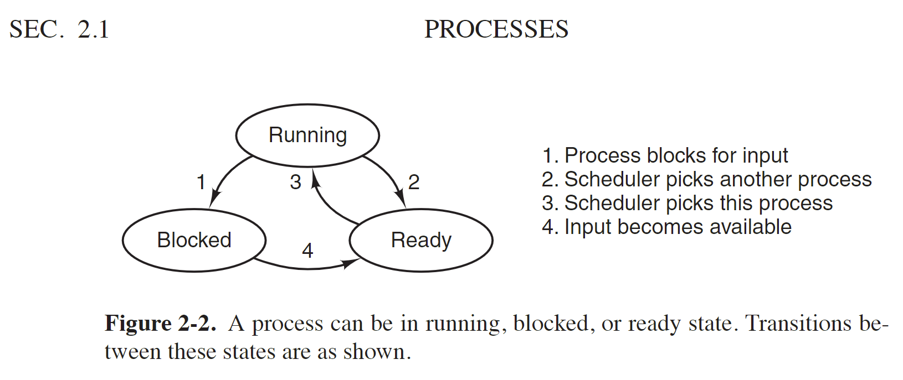
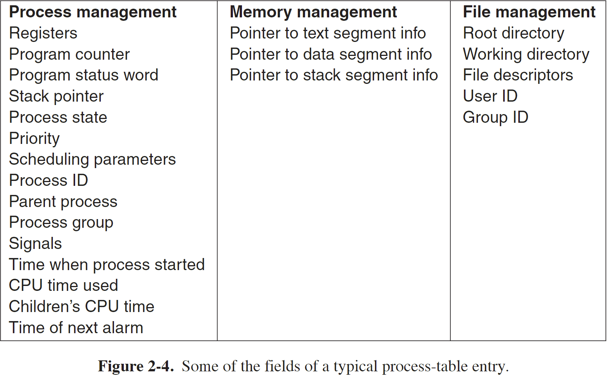
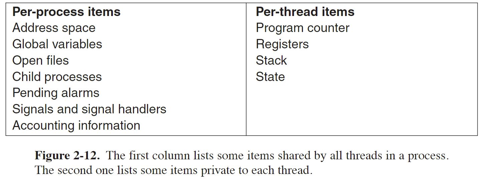
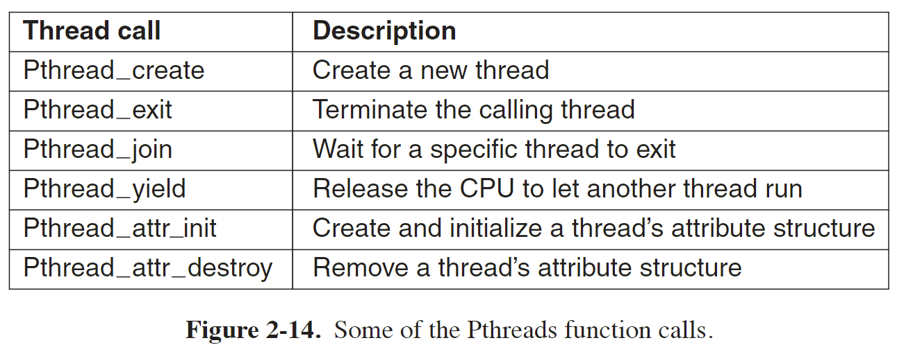
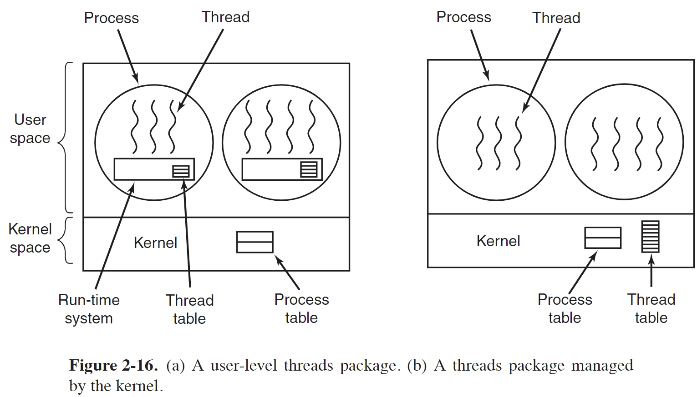
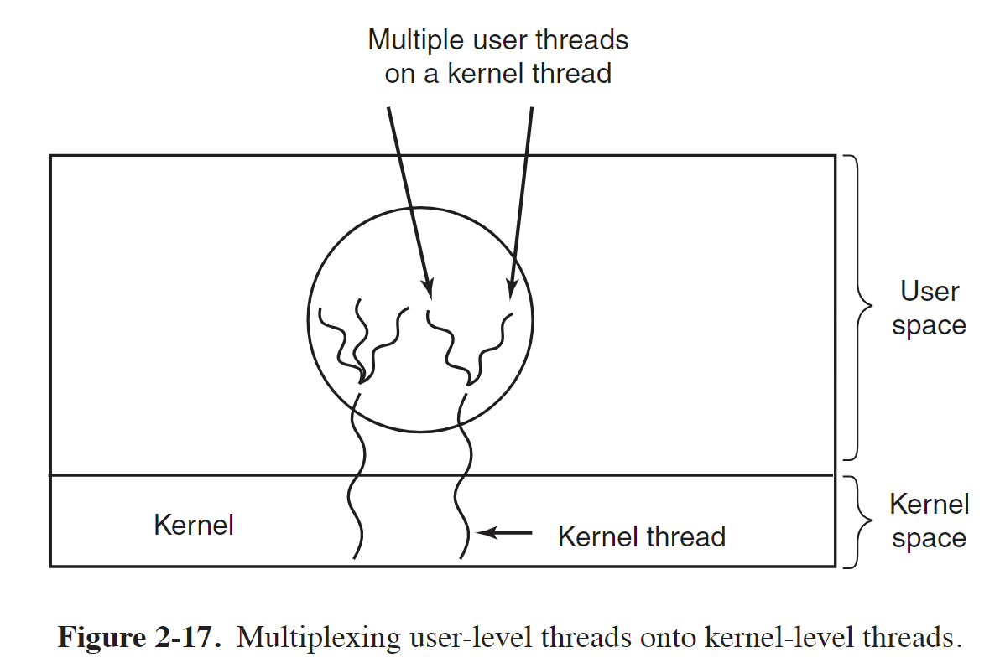
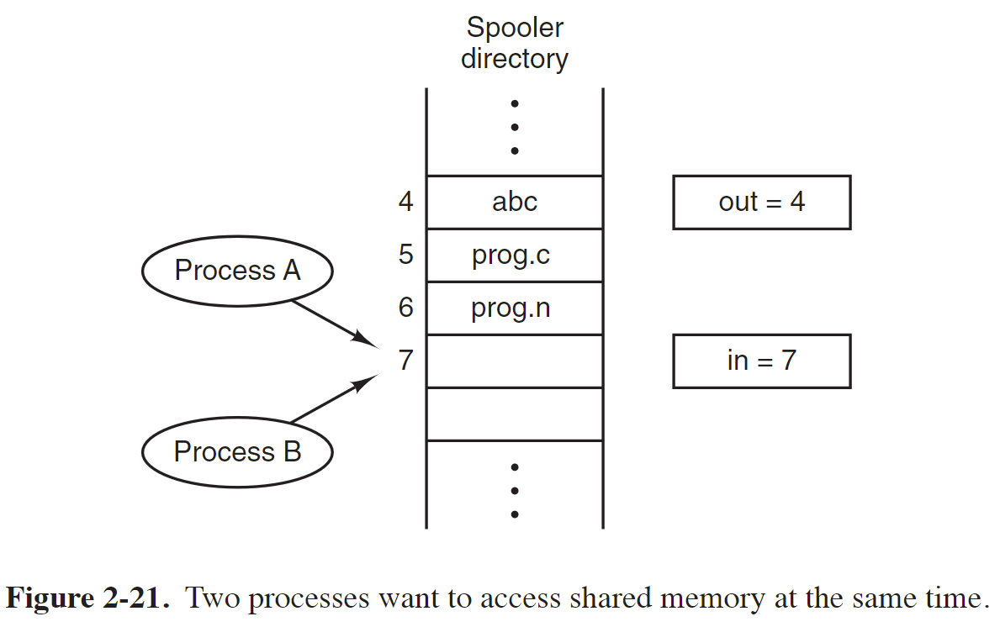
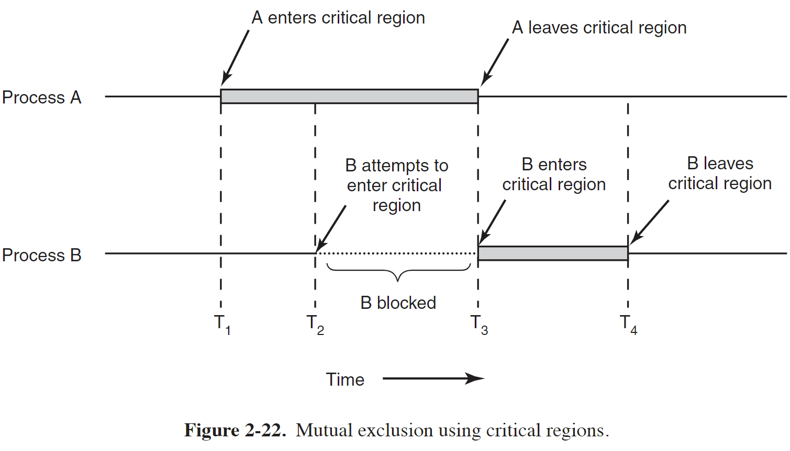

现代操作系统 第二章 进程和线程

# 进程
-  A process is just an instance of an executing program, including the current values of the program counter, registers, and variables.

- 前台进程
foreground processes, that is, processes that interact with (human) users and perform work for them. 
- 后台进程
Processes that stay in the background to handle some activity such as email, Web pages, news, printing, and so on are called daemons.

Four principal events cause processes to be created:
1. System initialization.
2. Execution of a process-creation system call by a running process.
3. A user request to create a new process.
4. Initiation of a batch job.

## Process Creation
In UNIX, there is only one system call to create a new process: fork. 

This call creates an exact clone of the calling process. 
After the fork, the two processes, the parent and the child, have the same memory image, the same environment strings, and the same open files. 

After a process is created, the parent and child have their own distinct address spaces. 

Some UNIX implementations share the **program text** between the two since that cannot be modified.

Alternatively, the child may share all of the parent’s memory, but in that case the memory is shared **copy-on-write**, which means that whenever either of the two wants to modify part of the memory, that chunk of memory is explicitly copied first to make sure the modification occurs in a private memory area. 

No writable memory is shared. 

## Process Termination
通常造成进程终止的条件有：
1. Normal exit (voluntary).
such as execute **exit** system call
2. Error exit (voluntary).
3. Fatal error (involuntary).
4. Killed by another process (involuntary).

## Process Hierarchies
In some systems, when a process creates another process, the parent process and child process continue to be associated in certain ways. 
The child process can itself create more processes, forming a process hierarchy.

## Process States

***************

> [Process state](https://en.wikipedia.org/wiki/Process_state)
> [States of a Process in Operating Systems](https://www.geeksforgeeks.org/states-of-a-process-in-operating-systems/)

> These distinct states may not be recognized as such by the operating system kernel. However, they are a useful abstraction for the understanding of processes.

### Created
- The process awaits admission to the "ready" state.
- Admission will be approved or delayed by a long-term, or admission, scheduler.

- 需要申请一个空白的 PCB，完成资源分配

### Ready
- A "ready" or "waiting" process has been loaded into main memory and is awaiting execution on a CPU. 

### Running
- A process moves into the running state when it is chosen for execution.
- There is at most one running process per CPU or core.
- A process can run in either of the two modes, namely kernel mode or user mode.

### Blocked
- A process transitions to a blocked state when it cannot carry on without an external change in state or event occurring.
- For example, a process may block on a call to an I/O device such as a printer, if the printer is not available.
- Processes also commonly block when they require user input, or require access to a critical section which must be executed [atomically](https://stackoverflow.com/questions/15054086/what-does-atomic-mean-in-programming).
- Such critical sections are protected using a synchronization object such as a semaphore or mutex.

### Terminated
- A process may be terminated, either from the "running" state by completing its execution or by explicitly being killed.
- The terminated process remains in the process table as a zombie process until its parent process calls the `wait` system call to read its exit status, at which point the process is removed from the process table, finally ending the process's lifetime.
- If the parent failes to call `wait`, this process continues to consume the process table entry (concretely the process identifier or PID), and causes a resource leak.

### Additional process states
> Two additional states are available for processes in systems that support virtual memory. 
> In both of these states, processes are "stored" on secondary memory (typically a hard disk).

- 进程被**挂起**（suspended）且**不会被调度**。
A process **stops** as a result of receiving a **SIGSTOP**, **SIGTSTP**, **SIGTTIN**, or **SIGTTOU** signal, 
and it **remains** **stopped** **until** it receives a **SIGCONT** signal, at which point it becomes running again.

- 按 `Ctrl z` 可以让进程处于 suspended 的状态，相当于发送信号 `SIGSTOP` 

#### Swapped out and waiting
- suspended and waiting
- The process is removed from main memory and placed on external storage by the scheduler.
- It may be swapped back into the waiting state.
#### Swapped out and blocked
- suspended and blocked
- The process is both blocked and swapped out
- It may be swapped back in again under the same circumstances as a swapped out and waiting process.

## Implementation of Processes
To implement the process model, the operating system maintains a table (an array of structures), called the process table, with one entry per process. (Some authors call these entries process control blocks.) 

This entry contains important information about the process’state, including its program counter, stack pointer,
memory allocation, the status of its open files, its accounting and scheduling information, and everything else about the process that must be saved when the process is switched from running to ready or blocked state so that it can be restarted later as if it had never been stopped.

# 线程
Processes are used to group resources together; threads are the entities scheduled for execution on the CPU.
进程是资源分配的基本单位
线程是 CPU 调度的基本单位

## 为什么需要线程
The main reason for having threads is that in many applications, multiple activities are going on at once. 
Some of these may block from time to time. 
By decomposing such an application into multiple sequential threads that run in quasi-parallel, the programming model becomes simpler.

A second argument for having threads is that since they are lighter weight than processes, they are easier (i.e., faster) to create and destroy than processes.

Threads yield no performance gain when all of them are CPU bound, but when there is substantial computing and also substantial I/O, having threads allows these activities to overlap, thus speeding up the application.

Threads are useful on systems with multiple CPUs, where real parallelism is possible

## 线程之间共享和独占的资源

 
Each thread has its own stack. 
Each thread’s stack contains one frame for each procedure called but not yet returned from.
This frame contains the procedure’s local variables and the return address to use when the procedure call has finished.

## 线程状态
- `thread_create`
When multithreading is present, processes usually start with a single thread present. 
This thread has the ability to create new threads by calling a library procedure such as `thread_create`.

Sometimes threads are hierarchical, with a parent-child relationship, 
but often no such relationship exists, with all threads being equal.

With or without a hierarchical relationship, the creating thread is usually returned a thread identifier that names the new thread.

- `thread_exit`
When a thread has finished its work, it can exit by calling a library procedure, say, `thread_exit`.

- thread_yield
`thread_yield` allows a thread to voluntarily give up the CPU to let another thread run.

## 多线程需要考虑的问题
1. If the parent process has multiple threads, should the child also have
them? 

If not, the process may not function properly, since all of them may be essential.

If the child process gets as many threads as the parent, what happens if a thread in the parent was blocked on a read call, say, from the keyboard

2.  What happens if one thread closes a file while another one is still read-
ing from it?

## POSIX Threads
To make it possible to write portable threaded programs, IEEE has defined a standard for threads in IEEE standard 1003.1c. 
The threads package it defines is called Pthreads. Most UNIX systems support it. 

## Implementing Threads 
> [线程的实现](https://xiaolincoding.com/os/4_process/process_base.html#线程的实现)

There are two main places to implement threads: user space and the kernel.

### Implementing Threads in User Space
When threads are managed in user space, each process needs its own private thread table to keep track of the threads in that process. 

This table is analogous to the kernel’s process table, except that it keeps track only of the per-thread properties, such as each thread’s program counter, stack pointer, registers, state, and so forth. 

The thread table is managed by the run-time system.

优点：
- 用户空间实现的线程进行上下文切换相对进程切换很快
- They allow each process to have its own customized scheduling algorithm. 

缺点：
- First among these is the problem of how blocking system calls are implemented.
One of the main goals of having threads in the first place was to allow each one to use blocking calls, 
but to prevent one blocked thread from affecting the others.

一个线程发起系统调用而阻塞会影响进程中的其他线程

- Another alternative is available in the event that it is possible to tell in advance if a call will block.

- Somewhat analogous to the problem of blocking system calls is the problem of page faults.
If a thread causes a page fault, the kernel, unaware of even the existence of threads, 
naturally blocks the entire process until the disk I/O is complete, even though other threads might be runnable.01.

- Another problem with user-level thread packages is that if a thread starts running, no other thread in that process will ever run unless the first thread voluntarily gives up the CPU. 

一个线程开始运行后，除非它主动交出 CPU 使用权，否则进程中的其他线程无法运行，因为用户态线程不能由操作系统调度
进程内部可以可以自己做一些调度规则

### Implementing Threads in Kernel Space
The kernel has a thread table that keeps track of all the threads in the system. 

When a thread wants to create a new thread or destroy an existing thread, 
it makes a kernel call, which then does the creation or destruction by updating the kernel thread table.

优点：
一个线程因为系统调用阻塞，不会影响进程中的其他线程
CPU 根据线程调度

缺点：
操作系统维护线程表、线程控制块 TCB
线程的创建、切换和终止都是通过系统调用，系统开销大

### Hybrid Implementation
一个应用程序可以同时用内核线程和用户线程，一个内核线程可以对应多个用户线程，数量由用户定义

In this model, each kernel-level thread has some set of user-level threads that take turns using it.
只有内核线程能被 CPU 调度

## Scheduler Activations
调度程序激活，是操作系统调度和执行线程的一种机制，旨在改进多线程程序的性能和可伸缩性

The goals of the scheduler activation work are to mimic the functionality of kernel threads, but with the better performance and greater flexibility usually associated with threads packages implemented in user space. 

When scheduler activations are used, the kernel assigns a certain number of virtual processors to each process and lets the (user-space) run-time system allocate threads to processors.

virtual processors 的数量可以根据需要动态增加和减少

当一个线程阻塞时，内核通过 upcall 通知用户空间的 run-time system，passing as parameters on the stack the number of the thread in question and a description of the event that occurred. 
然后 run-time system 重新调度一个新线程执行，因此避免一个线程阻塞而影响进程中其他线程

### upcall
上调用，用于将控制权从低级别的执行环境传递到高级别的执行环境。

上调用通常发生在操作系统内核和应用程序之间，或者在较低级别的软件组件和较高级别的软件组件之间。当发生某种事件或需要上层处理时，低级别的环境会发起一个上调用，将控制权传递给较高级别的环境，以便执行相应的处理逻辑。

上调用的目的是向上层组件或环境报告事件、请求服务或通知状态变化等。高级别的执行环境可以是应用程序的用户空间、应用程序的库、操作系统的内核等。

上调用的过程通常涉及一些协议和机制，以确保正确的传递控制权和数据。这可能包括上下文切换、参数传递、状态保存和恢复等操作。

上调用在操作系统和应用程序之间起到了桥梁的作用，允许不同层次的软件组件进行交互和协作。它提供了一种灵活的机制，使得低级别的组件能够通知和请求高级别的组件，从而实现功能扩展、事件处理和系统管理等操作。

总之，上调用是一种将控制权从低级别的执行环境传递到高级别的执行环境的机制，用于报告事件、请求服务或通知状态变化等。它在计算机系统中起到了重要的协作和交互的作用。

# Interprocess Communication
进程间通信，IPC

进程间通信需要面临下面三个问题：
- 进程将怎么传递信息
传递信息在线程之间比较好处理，因为线程之间共享地址空间
- 处理多个进程竞争同一个资源的情况
- 多个进程之间运行可能有一定依赖关系，需要合适的顺序
如进程 B 可能需要进程 A 执行完成才能执行

第二个和第三个问题在多线程通信同样需要解决

## Race Conditions
多个进程一起访问共享资源可能导致竞争条件

To see how interprocess communication works in practice, let us now consider a simple but common example: a print spooler. 
When a process wants to print a file, it enters the file name in a special spooler directory. 
Another process, the printer daemon, periodically checks to see if there are any files to be printed, and if there are, it prints them and then removes their names from the directory.

Imagine that our spooler directory has a very large number of slots, numbered 0, 1, 2, ..., each one capable of holding a file name. 

Also imagine that there are two shared variables, `out`, which points to the next file to be printed, and `in`, which points to the next free slot in the directory. 
These two variables might well be kept in a two-word file available to all processes. 

见上图所示，可能发生下面情况：
1. 进程 A 读变量 `in` 的值后保存该值 7 到局部变量 `next_free_slot`中
2. 然后该进程所占的时钟周期用完，CPU 调度到进程 B 来运行
3. 进程 B 同样获取变量 `in` 的值，即 7 
4. 接着进程 B 保存一个文件名到 slot 7 然后将 `in` 的值设置为 8，接着做其他事
5. 等 CPU 又调度到进程 A 运行时，由于之前进程 A 保存了 `in` 的值为 7，因此将要写入的文件名写到 slot 7 中覆盖掉进程 B 写入的内容， 然后进程 A 将 `in` 设置为 8
6. 最后进程 B 写入的文件名将不会被打印

上面这种多个进程读写共享资源，最终的结果取决于谁在何时准确运行的情况，结果存在不确定性（indeterminate）叫做竞争条件，即 race conditons。

## Critical Regions
为了避免竞争条件，需要避免多个进程同时读写共享资源，即 mutual exclusion，互斥

临界区，即 critical region，指一段代码或代码块，其中包含对共享资源的访问

如果能避免多个进程同时进入临界区，则能避免竞争

## 互斥的实现
> [互斥与同步的实现和使用](https://xiaolincoding.com/os/4_process/multithread_sync.html#互斥与同步的实现和使用)

### Disabling Interrupts
从之前例子看出，竞争出现在于一个进程访问共享资源时，操作到一半被打断，然后另一个进程访问该资源，
因此第一种方案是不让第一个进程访问时被中断

该方案不可取：
1. 让用户进程有权限关闭中断是很危险的行为，如果该进程一直占用 CPU 资源呢？
2. 即使让内核来禁止中断，也无法解决多核的情况，多核仍会发生竞争

### 锁
假设有一个共享变量 `turn`，初始该变量的值为 0，如果某个进程需要进入临界区，先查看该变量的值，
该值为 0 则表示临界区没有其他进程访问，因此该进程将变量设置为 1 获取锁，然后进入临界区

该方案需要查看变量和设置变量的操作不能中断，否则仍会发生竞争，即一个进程查看变量为 0，但还未设置其值为 1就被中断，
接着另一个变量获取锁，切换到第一个进程时，该进程根据之前获取的 `turn` 值 0，也进入临界区且将变量设置为 1

上述问题可以通过 TSL 指令解决

#### TSL 指令
- Test and Set Lock
- 该指令测试和设置锁，是一组原子操作指令，即要么全部执行完成，要么不执行
It reads the contents of the memory word lock into register RX and then stores a nonzero value at the memory address lock. 
The CPU executing the TSL instruction locks the memory bus to prohibit other CPUs from accessing memory until it is done.

#### 自旋锁 spin lock
当一个进程获取不到锁时，一直循环测试锁是否已被释放，等待获取锁，也被称为忙等待锁
A lock that uses busy waiting is called a spin lock.

这种忙等待可能浪费 CPU 时间
可以用 sleep 来阻塞而非循环测试浪费 CPU 时间，然后通过 wakeup 唤醒

### 生产者-消费者问题
- The producer-consumer problem

加入两个进程共享一段缓冲区，其中一个进程为生产者，向缓冲区中放入数据；另一个进程从缓冲区取出数据，为消费者
这里假设一个生产者和一个消费者

当缓冲区满了时，生产者停止生成，进入 sleep 状态，直到消费者消费数据后将其唤醒
当缓冲区空了时，消费者停止消费，进入 sleep 状态，直到生成者生成数据后将其唤醒

用一个共享变量 `count` 来表示缓冲区的数据的大小

如果消费者准备消费时，获取 `count` 的值为 0，将其保存，结果此时调度器将此进程停止，调度到生产者进程
生产者进程生产一个数据，此时 `count` 的值为 1，
生产者意识到之前缓冲区无数据，认为消费者处于 sleep 状态，因此调用 wakeup 将消费者唤醒
消费者此时并没有处于 sleep 状态，因此不会被 wakeup 唤醒
当调度器调度到消费者进程时，消费者根据之前保存的 `count` 值 0，进入 sleep 状态，等待被唤醒
而生产者继续生产，不会再调用 wakeup 将消费者唤醒，直到缓冲区满，此时生产者也进入 sleep 状态，等待消费者消费后将其唤醒
最终生成者和消费者都进入 sleep 状态

上述问题也是两个进程访问共享资源 `count` 而发生的竞争情况造成的

解决方案：
增加一个 wakeup waiting bit，当一个进程处于 awake 状态而收到 wakeup 信号时，将该位置 1，
如果之后该进程准备进入 sleep 状态，则检查 wakeup waiting bit，如果为 1，则进程仍保持 awake 状态，然后将该位清零

但如果有多个进程，一个 wakeup waiting bit 不够用，需要多个多个位

### 信号量 Semaphores
A semaphore could have the value 0, indicating that no wakeups were saved, or some positive value if one or more wakeups were pending.

