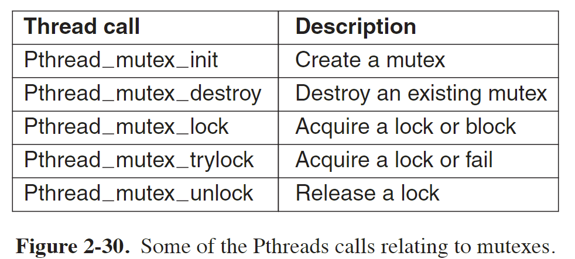
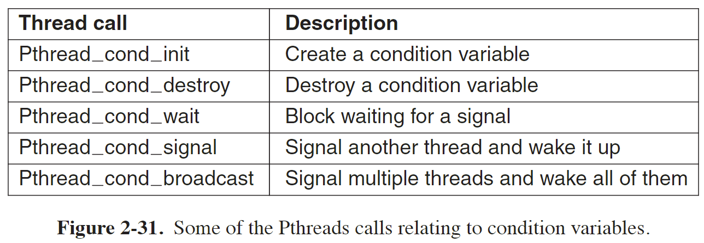
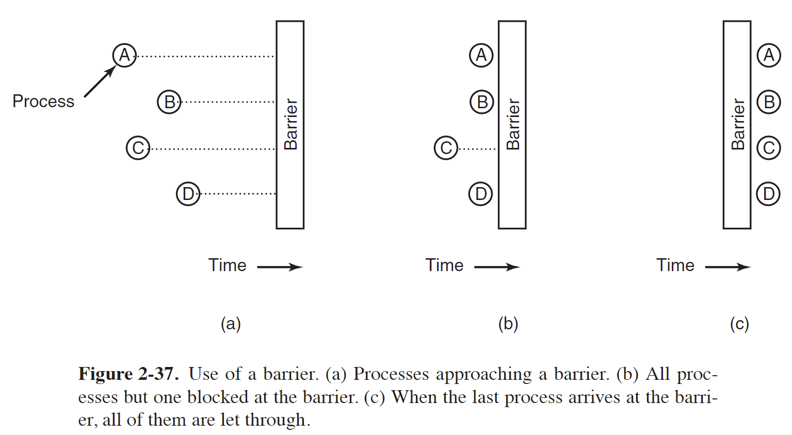
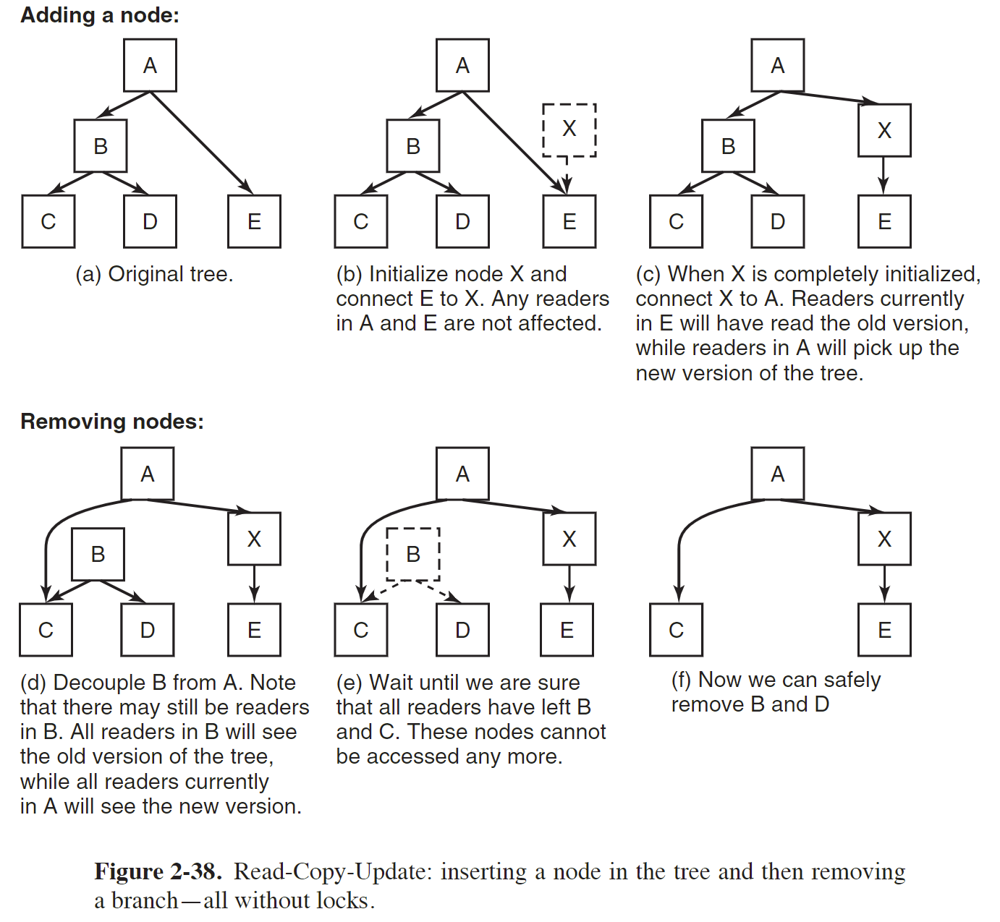
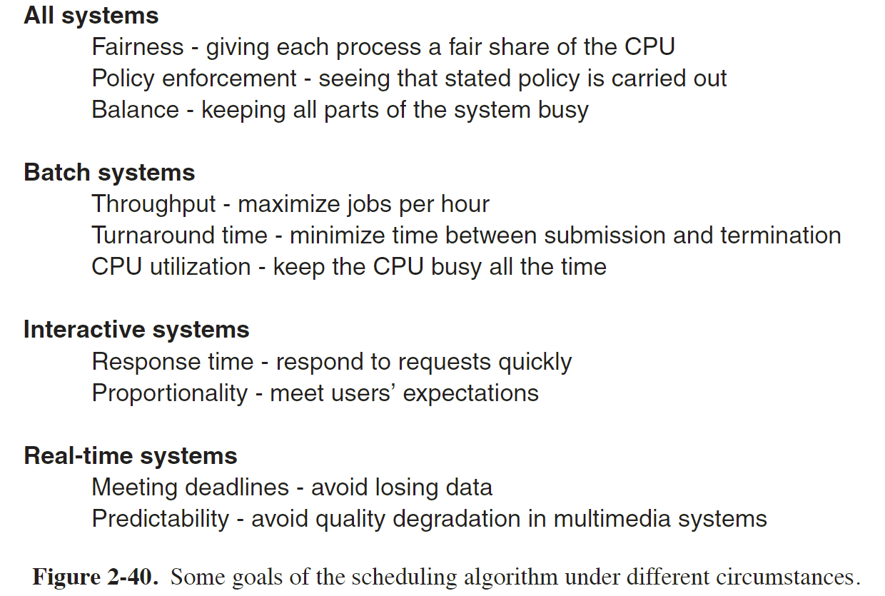
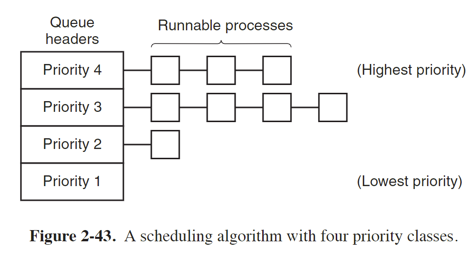

现代操作系统 第二章 进程和线程  
    
# 进程  
-  A process is just an instance of an executing program, including the current values of the program counter, registers, and variables.  
- 前台进程  
foreground processes, that is, processes that interact with (human) users and perform work for them.  
- 后台进程  
Processes that stay in the background to handle some activity such as email, Web pages, news, printing, and so on are called daemons.  
    
Four principal events cause processes to be created:  
1. System initialization.  
2. Execution of a process-creation system call by a running process.  
3. A user request to create a new process.  
4. Initiation of a batch job.  
    
## Process Creation  
In UNIX, there is only one system call to create a new process: fork.  
    
This call creates an exact clone of the calling process.  
After the fork, the two processes, the parent and the child, have the same memory image, the same environment strings, and the same open files.  
    
After a process is created, the parent and child have their own distinct address spaces.  
    
Some UNIX implementations share the **program text** between the two since that cannot be modified.  
    
Alternatively, the child may share all of the parent’s memory, but in that case the memory is shared **copy-on-write**, which means that whenever either of the two wants to modify part of the memory, that chunk of memory is explicitly copied first to make sure the modification occurs in a private memory area.  
    
No writable memory is shared.  
    
## Process Termination  
通常造成进程终止的条件有：  
1. Normal exit (voluntary).  
such as execute **exit** system call  
2. Error exit (voluntary).  
3. Fatal error (involuntary).  
4. Killed by another process (involuntary).  
    
## Process Hierarchies  
In some systems, when a process creates another process, the parent process and child process continue to be associated in certain ways.  
The child process can itself create more processes, forming a process hierarchy.  
    
## Process States  
  
    
    
***************  
    
> [Process state](https://en.wikipedia.org/wiki/Process_state)  
> [States of a Process in Operating Systems](https://www.geeksforgeeks.org/states-of-a-process-in-operating-systems/)  
    
> These distinct states may not be recognized as such by the operating system kernel. However, they are a useful abstraction for the understanding of processes.  
    
### Created  
- The process awaits admission to the "ready" state.  
- Admission will be approved or delayed by a long-term, or admission, scheduler.  
- 需要申请一个空白的 PCB，完成资源分配  
    
### Ready  
- A "ready" or "waiting" process has been loaded into main memory and is awaiting execution on a CPU.  
    
### Running  
- A process moves into the running state when it is chosen for execution.  
- There is at most one running process per CPU or core.  
- A process can run in either of the two modes, namely kernel mode or user mode.  
    
### Blocked  
- A process transitions to a blocked state when it cannot carry on without an external change in state or event occurring.  
- For example, a process may block on a call to an I/O device such as a printer, if the printer is not available.  
- Processes also commonly block when they require user input, or require access to a critical section which must be executed [atomically](https://stackoverflow.com/questions/15054086/what-does-atomic-mean-in-programming).  
- Such critical sections are protected using a synchronization object such as a semaphore or mutex.  
    
    
### Terminated  
- A process may be terminated, either from the "running" state by completing its execution or by explicitly being killed.  
- The terminated process remains in the process table as a zombie process until its parent process calls the `wait` system call to read its exit status, at which point the process is removed from the process table, finally ending the process's lifetime.  
- If the parent failes to call `wait`, this process continues to consume the process table entry (concretely the process identifier or PID), and causes a resource leak.  
    
    
### Additional process states  
> Two additional states are available for processes in systems that support virtual memory.  
> In both of these states, processes are "stored" on secondary memory (typically a hard disk).  
    
- 进程被**挂起**（suspended）且**不会被调度**。  
A process **stops** as a result of receiving a **SIGSTOP**, **SIGTSTP**, **SIGTTIN**, or **SIGTTOU** signal,  
and it **remains** **stopped** **until** it receives a **SIGCONT** signal, at which point it becomes running again.  
    
- 按 `Ctrl z` 可以让进程处于 suspended 的状态，相当于发送信号 `SIGSTOP`  
    
    
#### Swapped out and waiting  
- suspended and waiting  
- The process is removed from main memory and placed on external storage by the scheduler.  
- It may be swapped back into the waiting state.  
#### Swapped out and blocked  
- suspended and blocked  
- The process is both blocked and swapped out  
- It may be swapped back in again under the same circumstances as a swapped out and waiting process.  
    
    
## Implementation of Processes  
To implement the process model, the operating system maintains a table (an array of structures), called the process table, with one entry per process. (Some authors call these entries process control blocks.)  
    
This entry contains important information about the process’state, including its program counter, stack pointer, memory allocation, the status of its open files, its accounting and scheduling information, and everything else about the process that must be saved when the process is switched from running to ready or blocked state so that it can be restarted later as if it had never been stopped.  
    
  
    
# 线程  
Processes are used to group resources together; threads are the entities scheduled for execution on the CPU.  
    
进程是资源分配的基本单位，线程是 CPU 调度的基本单位  
    
## 为什么需要线程  
The main reason for having threads is that in many applications, multiple activities are going on at once.  
Some of these may block from time to time.  
By decomposing such an application into multiple sequential threads that run in quasi-parallel, the programming model becomes simpler.  
    
A second argument for having threads is that since they are lighter weight than processes, they are easier (i.e., faster) to create and destroy than processes.  
    
Threads yield no performance gain when all of them are CPU bound, but when there is substantial computing and also substantial I/O, having threads allows these activities to overlap, thus speeding up the application.  
    
Threads are useful on systems with multiple CPUs, where real parallelism is possible  
    
    
## 线程之间共享和独占的资源  
    
  
    
     
Each thread has its own stack.  
Each thread’s stack contains one frame for each procedure called but not yet returned from.  
This frame contains the procedure’s local variables and the return address to use when the procedure call has finished.  
    
    
## 线程状态  
- `thread_create`  
When multithreading is present, processes usually start with a single thread present.  
This thread has the ability to create new threads by calling a library procedure such as `thread_create`.  
Sometimes threads are hierarchical, with a parent-child relationship, but often no such relationship exists, with all threads being equal.  
With or without a hierarchical relationship, the creating thread is usually returned a thread identifier that names the new thread.  
    
- `thread_exit`  
When a thread has finished its work, it can exit by calling a library procedure, say, `thread_exit`.  
    
- `thread_yield`  
`thread_yield` allows a thread to voluntarily give up the CPU to let another thread run.  
    
## 多线程需要考虑的问题  
1. If the parent process has multiple threads, should the child also have them?  
If not, the process may not function properly, since all of them may be essential.  
If the child process gets as many threads as the parent, what happens if a thread in the parent was blocked on a read call, say, from the keyboard  
    
2. What happens if one thread closes a file while another one is still reading from it?  
    
## POSIX Threads  
To make it possible to write portable threaded programs, IEEE has defined a standard for threads in IEEE standard 1003.1c.  
The threads package it defines is called Pthreads. Most UNIX systems support it.  
    
  
    
    
## Implementing Threads  
> [线程的实现](https://xiaolincoding.com/os/4_process/process_base.html#线程的实现)  
    
There are two main places to implement threads: user space and the kernel.  
    
  
    
### Implementing Threads in User Space  
When threads are managed in user space, each process needs its own private thread table to keep track of the threads in that process.  
    
This table is analogous to the kernel’s process table, except that it keeps track only of the per-thread properties, such as each thread’s program counter, stack pointer, registers, state, and so forth.  
    
The thread table is managed by the run-time system.  
    
优点：  
- 用户空间实现的线程进行上下文切换相对进程切换很快  
- They allow each process to have its own customized scheduling algorithm.  
    
缺点：  
- First among these is the problem of how blocking system calls are implemented.  
One of the main goals of having threads in the first place was to allow each one to use blocking calls,  
but to prevent one blocked thread from affecting the others.  
一个线程发起系统调用而阻塞会影响进程中的其他线程  
    
- Another alternative is available in the event that it is possible to tell in advance if a call will block.  
    
- Somewhat analogous to the problem of blocking system calls is the problem of page faults.  
If a thread causes a page fault, the kernel, unaware of even the existence of threads,  
naturally blocks the entire process until the disk I/O is complete, even though other threads might be runnable.01.  
    
- Another problem with user-level thread packages is that if a thread starts running, no other thread in that process will ever run unless the first thread voluntarily gives up the CPU.  
一个线程开始运行后，除非它主动交出 CPU 使用权，否则进程中的其他线程无法运行，因为用户态线程不能由操作系统调度  
进程内部可以可以自己做一些调度规则  
    
### Implementing Threads in Kernel Space  
The kernel has a thread table that keeps track of all the threads in the system.  
    
When a thread wants to create a new thread or destroy an existing thread,  
it makes a kernel call, which then does the creation or destruction by updating the kernel thread table.  
    
优点：  
一个线程因为系统调用阻塞，不会影响进程中的其他线程  
CPU 根据线程调度  
    
缺点：  
操作系统维护线程表、线程控制块 TCB  
线程的创建、切换和终止都是通过系统调用，系统开销大  
    
### Hybrid Implementation  
一个应用程序可以同时用内核线程和用户线程，一个内核线程可以对应多个用户线程，数量由用户定义  
    
  
    
In this model, each kernel-level thread has some set of user-level threads that take turns using it.  
只有内核线程能被 CPU 调度  
    
## Scheduler Activations  
调度程序激活，是操作系统调度和执行线程的一种机制，旨在改进多线程程序的性能和可伸缩性  
    
The goals of the scheduler activation work are to mimic the functionality of kernel threads, but with the better performance and greater flexibility usually associated with threads packages implemented in user space.  
    
When scheduler activations are used, the kernel assigns a certain number of virtual processors to each process and lets the (user-space) run-time system allocate threads to processors.  
    
virtual processors 的数量可以根据需要动态增加和减少  
    
当一个线程阻塞时，内核通过 upcall 通知用户空间的 run-time system，passing as parameters on the stack the number of the thread in question and a description of the event that occurred.  
然后 run-time system 重新调度一个新线程执行，因此避免一个线程阻塞而影响进程中其他线程  
    
### upcall  
上调用，用于将控制权从低级别的执行环境传递到高级别的执行环境。  
    
上调用通常发生在操作系统内核和应用程序之间，或者在较低级别的软件组件和较高级别的软件组件之间。当发生某种事件或需要上层处理时，低级别的环境会发起一个上调用，将控制权传递给较高级别的环境，以便执行相应的处理逻辑。  
    
上调用的目的是向上层组件或环境报告事件、请求服务或通知状态变化等。高级别的执行环境可以是应用程序的用户空间、应用程序的库、操作系统的内核等。  
    
上调用的过程通常涉及一些协议和机制，以确保正确的传递控制权和数据。这可能包括上下文切换、参数传递、状态保存和恢复等操作。  
    
上调用在操作系统和应用程序之间起到了桥梁的作用，允许不同层次的软件组件进行交互和协作。它提供了一种灵活的机制，使得低级别的组件能够通知和请求高级别的组件，从而实现功能扩展、事件处理和系统管理等操作。  
    
总之，上调用是一种将控制权从低级别的执行环境传递到高级别的执行环境的机制，用于报告事件、请求服务或通知状态变化等。它在计算机系统中起到了重要的协作和交互的作用。  
    
# Interprocess Communication  
> [5.2 进程间有哪些通信方式？](https://xiaolincoding.com/os/4_process/process_commu.html)  
    
进程间通信，IPC  
    
进程间通信需要面临下面三个问题：  
- 进程将怎么传递信息  
传递信息在线程之间比较好处理，因为线程之间共享地址空间  
- 处理多个进程竞争同一个资源的情况  
- 多个进程之间运行可能有一定依赖关系，需要合适的顺序  
如进程 B 可能需要进程 A 执行完成才能执行，该问题也称为同步（synchronization）问题  
    
    
第二个和第三个问题在多线程通信同样需要解决  
    
## Race Conditions  
多个进程一起访问共享资源可能导致竞争条件  
    
To see how interprocess communication works in practice, let us now consider a simple but common example: a print spooler.  
When a process wants to print a file, it enters the file name in a special spooler directory.  
Another process, the printer daemon, periodically checks to see if there are any files to be printed, and if there are, it prints them and then removes their names from the directory.  
    
Imagine that our spooler directory has a very large number of slots, numbered 0, 1, 2, ..., each one capable of holding a file name.  
    
Also imagine that there are two shared variables, `out`, which points to the next file to be printed, and `in`, which points to the next free slot in the directory.  
These two variables might well be kept in a two-word file available to all processes.  
    
  
    
见上图所示，可能发生下面情况：  
1. 进程 A 读变量 `in` 的值后保存该值 7 到局部变量 `next_free_slot`中  
2. 然后该进程所占的时钟周期用完，CPU 调度到进程 B 来运行  
3. 进程 B 同样获取变量 `in` 的值，即 7  
4. 接着进程 B 保存一个文件名到 slot 7 然后将 `in` 的值设置为 8，接着做其他事  
5. 等 CPU 又调度到进程 A 运行时，由于之前进程 A 保存了 `in` 的值为 7，因此将要写入的文件名写到 slot 7 中覆盖掉进程 B 写入的内容， 然后进程 A 将 `in` 设置为 8  
6. 最后进程 B 写入的文件名将不会被打印  
    
上面这种多个进程读写共享资源，最终的结果取决于谁在何时准确运行的情况，结果存在不确定性（indeterminate）叫做竞争条件，即 race conditons。  
    
## Critical Regions  
为了避免竞争条件，需要避免多个进程同时读写共享资源，即 mutual exclusion，互斥  
    
临界区，即 critical region，指一段代码或代码块，其中包含对共享资源的访问  
    
如果能避免多个进程同时进入临界区，则能避免竞争  
    
  
    
    
## 互斥的实现  
> [互斥与同步的实现和使用](https://xiaolincoding.com/os/4_process/multithread_sync.html#互斥与同步的实现和使用)  
    
    
### Disabling Interrupts  
从之前例子看出，竞争出现在于一个进程访问共享资源时，操作到一半被打断，然后另一个进程访问该资源，因此第一种方案是不让第一个进程访问时被中断  
    
该方案不可取：  
1. 让用户进程有权限关闭中断是很危险的行为，如果该进程一直占用 CPU 资源呢？  
2. 即使让内核来禁止中断，也无法解决多核的情况，多核仍会发生竞争  
    
### 锁  
假设有一个共享变量 `turn`，初始该变量的值为 0，如果某个进程需要进入临界区，先查看该变量的值，  
该值为 0 则表示临界区没有其他进程访问，因此该进程将变量设置为 1 获取锁，然后进入临界区  
    
该方案需要查看变量和设置变量的操作不能中断，否则仍会发生竞争，即一个进程查看变量为 0，但还未设置其值为 1就被中断，  
接着另一个变量获取锁，切换到第一个进程时，该进程根据之前获取的 `turn` 值 0，也进入临界区且将变量设置为 1  
    
上述问题可以通过 TSL 指令解决  
    
#### TSL 指令  
- Test and Set Lock  
- 该指令测试和设置锁，是一组原子操作指令，即要么全部执行完成，要么不执行  
It reads the contents of the memory word lock into register RX and then stores a nonzero value at the memory address lock.  
The CPU executing the TSL instruction locks the memory bus to prohibit other CPUs from accessing memory until it is done.  
    
#### 自旋锁 spin lock  
当一个进程获取不到锁时，一直循环测试锁是否已被释放，等待获取锁，也被称为忙等待锁  
A lock that uses busy waiting is called a spin lock.  
    
这种忙等待可能浪费 CPU 时间  
可以用 sleep 来阻塞而非循环测试浪费 CPU 时间，然后通过 wakeup 唤醒  
    
    
### 生产者-消费者问题  
The producer-consumer problem  
    
假如两个进程共享一段缓冲区，其中一个进程为生产者，向缓冲区中放入数据；另一个进程从缓冲区取出数据，为消费者  
这里假设一个生产者和一个消费者  
    
当缓冲区满了时，生产者停止生成，进入 sleep 状态，直到消费者消费数据后将其唤醒  
当缓冲区空了时，消费者停止消费，进入 sleep 状态，直到生成者生成数据后将其唤醒  
    
用一个共享变量 `count` 来表示缓冲区的数据的大小  
    
如果消费者准备消费时，获取 `count` 的值为 0，将其保存，结果此时调度器将此进程停止，调度到生产者进程  
生产者进程生产一个数据，此时 `count` 的值为 1，生产者意识到之前缓冲区无数据，认为消费者处于 sleep 状态，因此调用 wakeup 将消费者唤醒  
消费者此时并没有处于 sleep 状态，因此不会被 wakeup 唤醒  
当调度器调度到消费者进程时，消费者根据之前保存的 `count` 值 0，进入 sleep 状态，等待被唤醒  
而生产者继续生产，不会再调用 wakeup 将消费者唤醒，直到缓冲区满，此时生产者也进入 sleep 状态，等待消费者消费后将其唤醒  
最终生成者和消费者都进入 sleep 状态  
    
上述问题也是两个进程访问共享资源 `count` 而发生的竞争情况造成的  
    
解决方案：  
增加一个 wakeup waiting bit，当一个进程处于 awake 状态而收到 wakeup 信号时，将该位置 1，如果之后该进程准备进入 sleep 状态，则检查 wakeup waiting bit，如果为 1，则进程仍保持 awake 状态，然后将该位清零  
    
但如果有多个进程，一个 wakeup waiting bit 不够用，需要多个多个位  
    
### 信号量 Semaphores  
> [信号量](https://xiaolincoding.com/os/4_process/multithread_sync.html#信号量)  
    
A semaphore could have the value 0, indicating that no wakeups were saved, or some positive value if one or more wakeups were pending.  
    
信号量为一个整数变量，其值表示可用的资源数量  
    
信号量有两个原子操作，即 down 和 up，或者 sleep 和 wakeup  
- down  
当一个进程要访问共享资源时，检查信号量的值是否大于 0，是则将值减 1，然后继续访问资源；  
如果信号量为 0，则将进程进入 sleep 状态，等待其他进程释放资源  
- up  
当一个进程使用完共享资源后，执行 up 操作，将信号量的值加 1  
如果此时有其他进程处于 sleep 状态在等待该信号量资源，则选择其中一个唤醒，使其可以执行 down 操作  
    
down 和 up 操作最初也叫 Proberen (try) and Verhogen (raise, make higher) 操作，简写为 P 和 V。  
    
### Mutexes  
互斥锁，一种特殊的二进制信号量，只有两种状态：unlocked 和 locked  
通常用 0 表示 unlocked，非零的其他整数表示 locked  
    
### Futexes  
futex, fast user space mutex  
用户空间锁，提供高性能用户空间互斥锁，它的设计目标是在用户空间中实现互斥锁，避免频繁地陷入内核态，从而提高锁的性能和效率。  
    
A futex consists of two parts: a kernel service and a user library.  
    
The kernel service provides a ‘‘wait queue’’ that allows multiple processes to wait on a lock.  
They will not run, unless the kernel explicitly unblocks them.  
    
当一个进程（或线程）需要获取锁时，尝试在用户空间获取锁，如果锁是可用状态，则成功获取锁；  
否则，futex library 利用系统调用将当前线程放入内核的 wait queue中  
    
当持有锁的线程释放锁后，查看是否内核的 wait queue 中是否有进程处于阻塞状态，有则通知操作系统唤醒等待的进程  
    
### Mutexex in Pthreads  
    
  
    
In addition to mutexes, Pthreads offers a second synchronization mechanism: condition variables.  
Mutexes are good for allowing or blocking access to a critical region.  
Condition variables allow threads to block due to some condition not being met.  
    
  
    
    
### Monitors  
monitor（监视器）是一种同步机制，用于管理共享资源的访问和保证多线程或多进程之间的正确同步。  
它提供了一种结构化的方式来实现并发控制和互斥访问。  
    
A monitor is a collection of procedures, variables, and data structures that are all grouped together in a special kind  
of module or package.  
    
Processes may call the procedures in a monitor whenever they want to, but they cannot directly access the monitor’s internal data structures from procedures declared outside the monitor.  
    
Monitors have an important property that makes them useful for achieving mutual exclusion: **only one process can be active in a monitor at any instant**.  
    
### Message Passing  
消息传递，一种在并发计算和分布式系统中用于通信和同步的编程模型。  
它是一种基于消息的通信方式，其中进程或线程通过发送和接收消息来进行相互之间的通信和数据交换。  
    
在消息传递模型中，各个进程或线程是相对独立的实体，它们通过发送和接收消息来进行通信，而不是共享内存空间。  
消息是一种信息单元，包含要传递的数据和相关的元数据。  
发送者将消息发送到特定的目标，接收者则从指定来源接收消息。  
    
消息传递使用两个原语，send 和 receive，是系统调用  
```bash  
send(destination, &message);  
receive(source, &message);  
```  
    
消息传递方案面临的问题：  
1. 消息传递可能发生在不同的机器之间，通过网络传输，因此有丢失风险  
发送消息后，接收者需要发送 acknowledgement 消息表示已经接收到消息  
但也有可能接收者已经收到消息，但确认消息丢失，因此发送者重新发送消息，此时接收者需要能区分重新发送的消息和新消息，可以通过给消息设置序号来区分  
    
2. how processes are named  
Message systems also have to deal with the question of how processes are named, so that the process specified in a send or receive call is unambiguous.  
    
3. 认证 Authentication  
客户端能认证服务端的身份  
    
4. 同一个机器中不同进程消息传递性能低  
Copying messages from one process to another is always slower than doing a semaphore operation or entering a monitor  
    
### Barriers  
barrier（屏障）是一种同步原语，用于确保多个线程或进程在某个点上达到同步，然后同时继续执行。  
Barrier通常用于将多个并发任务或线程分成多个阶段，并在每个阶段结束时等待所有任务或线程完成，然后再进行下一个阶段的执行。  
    
Some applications are divided into phases and have the rule that no process may proceed into the next phase  
until all processes are ready to proceed to the next phase.  
    
  
    
### Avoiding Locks: Read-Copy-UPdate  
Read-Copy-Update (RCU) 是一种并发编程中的技术，用于实现高效的读操作和低冲突的写操作。  
它通常应用于多核系统中，以提高并发性能和减少锁竞争。  
    
RCU 的核心思想是通过复制数据，并保留旧版本的数据（称为“读者”），以允许并发的读操作，而不会阻塞写操作。  
当需要进行写操作时，RCU 使用一种延迟策略，确保所有读操作完成后才进行更新。  
    
RCU 的主要步骤如下：  
    
1. 读操作：当进行读操作时，读者线程可以直接访问共享的数据结构，而不需要加锁。这允许多个读者同时访问数据，提高了并发性能。  
    
2. 写操作：当进行写操作时，RCU 使用一种延迟策略。它首先复制当前的数据结构，创建一个新的版本，然后将新版本的指针替换旧版本的指针。这样，新的读者可以读取新版本的数据，而旧的读者仍然可以访问旧版本的数据。  
    
3. 延迟和回收：RCU 使用延迟策略确保所有读操作都完成后再回收旧版本的数据。这通常涉及到一些机制，如引用计数、等待队列等，以确保没有读者正在访问旧版本的数据，然后才进行回收操作。  
    
RCU 的优点包括：  
    
- 高并发性：RCU 允许多个读者并发地访问共享数据，从而提高了读操作的性能和并发性能。  
- 低写冲突：由于读操作不需要加锁，写操作可以在不阻塞读操作的情况下进行。这减少了锁竞争和冲突的概率，提高了系统的吞吐量。  
- 低开销：相比于传统的锁机制，RCU 的开销相对较低，因为读操作不需要获取锁。  
    
然而，RCU 也存在一些限制和注意事项，如对数据结构的特定要求、需要额外的内存空间来存储旧版本的数据、写操作的延迟等。  
    
  
    
# 同步  
synchronize（同步）表示不同进程或线程之间相互协调和保持一致的操作。  
    
在并发环境中，多个进程或线程同时执行时，可能会涉及到共享资源的访问和修改，因而需要进行同步操作来确保数据的一致性和正确性。  
同步涉及到协调不同进程或线程之间的执行顺序、互斥访问共享资源、避免竞态条件等问题。  
    
常见的同步机制和操作包括：  
    
1. 互斥锁（Mutex）：用于实现互斥访问共享资源的机制。通过获取和释放互斥锁来控制对共享资源的访问，以保证在同一时间只有一个进程或线程能够进入临界区。  
    
2. 信号量（Semaphore）：用于控制对一定数量资源的访问。信号量可以用来限制同时访问共享资源的进程或线程数量，或者用于线程间的通信和同步。  
    
3. 条件变量（Condition Variable）：用于线程间的等待和通知机制。条件变量允许一个或多个线程等待特定条件的发生，并在条件满足时进行通知，从而协调线程的执行顺序。  
    
4. 屏障（Barrier）：用于确保多个进程或线程在某个点上同步。屏障可以用于等待所有参与者达到一个共同点之后再继续执行，以实现协同工作或同步操作。  
    
这些同步机制和操作可帮助实现正确的并发控制和资源管理，避免数据竞争和不一致性。在操作系统中，同步是一项关键任务，确保不同进程或线程之间的正确交互和协作。  
    
因此，在操作系统中，"synchronize"（同步）指的是通过使用同步机制和操作，协调不同进程或线程之间的执行顺序、互斥访问共享资源、避免竞态条件等，以保持一致和正确的操作。  
    
# Scheduling  
根据进程行为分为两类：  
- Compute-bound processes  
typically have long CPU bursts and thus infrequent I/O waits  
- I/O-bound processes  
have short CPU bursts and thus frequent I/O waits  
    
根据如何处理时钟中断将调度算法分为两类：  
- nonpreemptive scheduling algorithm  非抢占式调度算法  
picks a process to run and then just lets it run until it blocks (either on I/O or waiting for another process) or voluntarily releases the CPU.  
- preemptive scheduling algorithm  抢占式调度算法  
  picks a process and lets it run for a maximum of some fixed time.  
  It is still running at the end of the time interval, it is suspended and the scheduler picks another process to run (if one is available).  
    
根据应用领域的不同对调度算法进行分类：  
- Batch  
抢占式或非抢占式都可以  
- Interactive  
通常需要抢占式调度算法，防止某个进程独占 CPU  
交互式系统是通用的计算机系统，用户可以在其中运行各种不同的程序，包括办公软件、游戏、网络浏览器等。  
这些系统提供给用户一个交互界面，允许用户进行各种操作和任务。  
由于交互式系统的灵活性和通用性，用户可以运行各种不同的程序，这些程序可能是不同的开发者编写的，也可能包含恶意代码。  
- Real time  
In systems with real-time constraints, preemption is, oddly enough, sometimes not needed because the processes know that they may not run for long periods of time and usually do their work and block quickly.  
实时系统是为满足特定应用程序的时间要求而设计的。  
这些系统需要按照预定的时间限制来响应和处理事件，以确保系统能够在规定的时间范围内完成任务。  
在实时系统中，只运行与应用程序相关的任务，这些任务旨在实现特定的功能或目标。  
    
## 调度算法的目标  
和所用的环境有关：  
  
    
- Throughput  
Throughput is the number of jobs per hour that the system completes.  
    
- Turnaround time  
Turnaround time is the statistically average time from the moment that a batch job is submitted until the moment it is completed.  
It measures how long the average user has to wait for the output.  
    
- response time  
The time between issuing a command and getting the result  
    
### All systems  
1. fairness  
Comparable processes should get comparable service.  
Different categories of processes may be treated differently.  
    
2. enforce the system's policy  
    
3. keep all parts of the system busy when possible  
In a batch system, for example, the scheduler has control of which jobs are brought into memory to run.  
Having some CPU-bound processes and some I/O-bound processes in memory together is a better idea than first loading and running all the CPU-bound jobs and then, when they are finished, loading and running all the I/O-bound jobs.  
    
## Scheduling in Batch Systems  
    
### First-Come,First-Served  
- 先来先服务算法，非抢占式  
- Basically, there is a single queue of ready processes.  
- 一个进程可以一直运行，不会由于运行时间太长被中断  
- When a blocked process becomes ready, like a newly arrived job, it is put on the end of the queue, behind all waiting processes.  
- 可以用一个单链表维护所有就绪状态的进程  
- 对长作业有利，适合 CPU 繁忙行作业的系统  
    
### Shortest Job First  
- 最短作业优先，非抢占式  
- The run time has to be known in advance.  
- It is worth pointing out that shortest job first is optimal only when all the jobs are available simultaneously.  
- 不利于长作业  
    
### Shortest Remaining Time Next  
- 最短作业优先的抢占式版本  
- The run time has to be known in advance.  
- With this algorithm, the scheduler always chooses the process whose remaining run time is the shortest  
If the new job needs less time to finish than the current process, the current process is suspended and the new job started.  
This scheme allows new short jobs to get good service.  
    
## Scheduling in Interactive Systems  
    
### Round-Robin Scheduling  
轮询算法，RR  
    
Each process is assigned a time interval, called its quantum, during which it is allowed to run.  
If the process is still running at the end of the quantum, the CPU is preempted and given to another process.  
    
Setting the quantum too short causes too many process switches and lowers the CPU efficiency, but setting it too long may cause poor response to short interactive requests.  
A quantum around 20–50 msec is often a reasonable compromise.  
    
### Priority Scheduling  
- 为每个进程分配优先级，从就绪队列中找到优先级最高的进程运行  
- 为了避免最高优先级进程一直运行，调度器会在每个时钟中断时降低当前运行进程的优先级  
  如果当前进程优先级低于其他进程，则调度器调度优先级高的进程运行  
- 每个进程也会分配一个最大的时间片，如果运行时间达到最大时长，调度器会调度下一个进程运行  
- 优先级可以静态或动态分配  
    
    
可以将进程按照优先级分组，每组内部用 RR 调度算法  
  
    
### Multiple Queues  
> [多级反馈队列调度算法](https://xiaolincoding.com/os/5_schedule/schedule.html#多级反馈队列调度算法)  
    
- 将进程按照优先级分类，即分组，一组为一个队列  
- 优先级高的组按照优先级调度算法先运行  
- 每组分配的时间片不同，优先级高的组时间配额低于优先级低的组  
    
### Shortest Process Next  
The problem is figuring out which of the currently runnable processes is the shortest one.  
One approach is to make estimates based on past behavior and run the process with the shortest estimated running time.  
    
### Guaranteed Scheduling  
Guaranteed Scheduling（保证调度）是一种调度策略，旨在确保特定类型的任务或进程得到系统资源的保证分配和执行。  
它确保在满足特定条件的情况下，任务可以按照规定的时间要求和优先级进行调度和执行。  
    
保证调度通常应用于对实时性能有严格要求的任务或系统，例如实时操作系统、嵌入式系统和通信系统等。  
它们需要确保某些关键任务能够按时得到执行，以满足实时性能需求。  
    
以下是保证调度的一些关键特性：  
    
1. 时间保证：保证调度确保任务能够按照预定的时间要求得到执行。它考虑任务的截止时间、响应时间和完成时间等因素，以确保任务能够及时完成。  
    
2. 优先级调度：保证调度通常使用优先级调度算法来确定任务的执行顺序。高优先级的任务将优先被调度和执行，以确保其实时性能和重要性。  
    
3. 资源保证：保证调度确保任务获得所需的系统资源，如处理器时间、内存、I/O设备等。它避免了资源争用和饥饿的情况，以保证任务得到适当的资源分配。  
    
4. 预测性能：保证调度需要对任务的执行时间、系统负载和资源利用率等进行预测和评估。它考虑系统的可调度性和性能瓶颈，以确保任务可以在要求的时间内得到可靠的执行。  
    
保证调度的目标是提供可靠的实时性能，确保关键任务能够满足其时间限制和性能要求。  
它需要综合考虑任务的调度顺序、资源分配和系统负载等因素，以提供可预测和保证的系统响应能力。  
    
### Lottery Scheduling  
> [Lottery Process Scheduling in Operating System](https://www.geeksforgeeks.org/lottery-process-scheduling-in-operating-system/)  
    
Lottery Scheduling（抽奖调度）是一种基于概率的调度算法，用于操作系统中的进程调度。  
它通过使用抽奖的方式来分配系统资源和确定进程执行顺序。  
每个进程被分配一个或多个彩票（tickets），并根据彩票的数量来确定它们获得资源的概率。  
    
1. 分配彩票  
系统中的资源被分配给进程的方式是通过为每个进程分配一定数量的彩票。  
彩票的数量可以根据进程的优先级、重要性或其他因素进行分配。  
    
3. 彩票抽奖  
当系统资源可用时，调度程序会随机抽取一个获胜者进程，获胜者将获得资源的使用权。  
抽奖过程是基于彩票的概率分布，彩票数量越多的进程获胜的机会也就越高。  
    
抽奖过程如下：  
- 计算所有进程的彩票总数。这是为了确定每个进程获胜的概率。  
- 通过随机数生成器生成一个随机数，范围在总彩票数之间。然后，使用这个随机数来选择获胜者。  
- 从彩票数量最多的进程开始，逐个检查每个进程的彩票数量。  
  如果生成的随机数小于等于当前进程的彩票数，该进程被选为获胜者。  
  否则，继续检查下一个进程，直到找到获胜者。  
    
3. 公平性  
Lottery Scheduling致力于提供公平的资源分配。  
彩票数量较多的进程在抽奖过程中有更高的概率获胜，但彩票数量较少的进程仍有一定机会获胜。  
这样可以确保较高优先级的进程相对于低优先级的进程具有更多的资源份额。  
    
4. 灵活性  
Lottery Scheduling允许进程灵活地控制和管理自己的彩票数量。  
进程可以根据自身的需求和优先级来增加或减少彩票数量，以影响其获胜的概率。  
    
    
Lottery Scheduling的优点是在分配资源时提供了一定的公平性和灵活性，较高优先级的进程获得更多资源的机会。  
然而，它也存在一些挑战，如对随机数生成的要求、彩票数量的管理和调整等。  
    
Lottery Scheduling被广泛应用于操作系统和分布式系统中，特别是在资源共享和多任务处理的场景中。  
它提供了一种随机化的资源分配方式，可以防止资源饥饿和提高系统的公平性。  
    
### Fair-Share Scheduling  
公平份额调度（Fair-Share Scheduling）是一种调度算法，旨在确保每个用户或组织在共享资源的环境中获得公平的资源分配。  
该算法基于每个用户或组织的资源需求和历史使用情况，以确定资源分配的优先级和比例。  
    
1. 资源分配比例  
在公平份额调度中，每个用户或组织被分配一个资源份额（share），该份额表示其应该获得的资源比例。  
资源份额可以根据用户的重要性、优先级或其他因素进行分配。  
    
3. 计算资源份额  
调度程序根据每个用户或组织的资源需求和历史使用情况，计算其应该获得的资源份额。  
这可以基于先前的资源使用情况、调度策略和权重等因素来决定。  
    
5. 资源调度  
当资源可用时，根据用户或组织的资源份额来分配资源。  
较高份额的用户将获得更多的资源分配，以满足其需求。  
公平份额调度的目标是确保每个用户或组织在一段时间内获得相等或相似的资源份额。  
    
7. 动态调整  
公平份额调度允许动态调整资源份额，以适应用户或组织的变化需求。  
如果某个用户的资源使用率较低，它的资源份额可以减少，让其他用户获得更多的资源。  
反之，如果某个用户的资源使用率较高，它的资源份额可以增加，以满足其需求。  
    
公平份额调度的目标是确保每个用户或组织能够公平地共享系统资源，避免资源饥饿和不公平的情况。  
它可以用于操作系统中的多用户环境、虚拟化平台、云计算等场景，以确保资源的公平分配和合理利用。  
    
## Scheduling in Real-Time Systems  
- hard real time  
there are absolute deadlines that must be met—or else!  
- soft real time  
missing an occasional deadline is undesirable, but nevertheless tolerable.  
    
## Thread Scheduling  
    
- User-level threads  
前面提到的调度算法都可以用，常用的是 RR 和优先级调度算法  
    
- Kernel-level threads  
内核级的线程调度需要考虑上下文切换耗时的问题  
    
    
# 经典的 IPC 问题  
## 哲学家就餐问题  
> [哲学家就餐问题](https://xiaolincoding.com/os/4_process/multithread_sync.html#哲学家就餐问题)  
    
## 读者和写者问题  
> [读者-写者问题](https://xiaolincoding.com/os/4_process/multithread_sync.html#读者-写者问题)  
