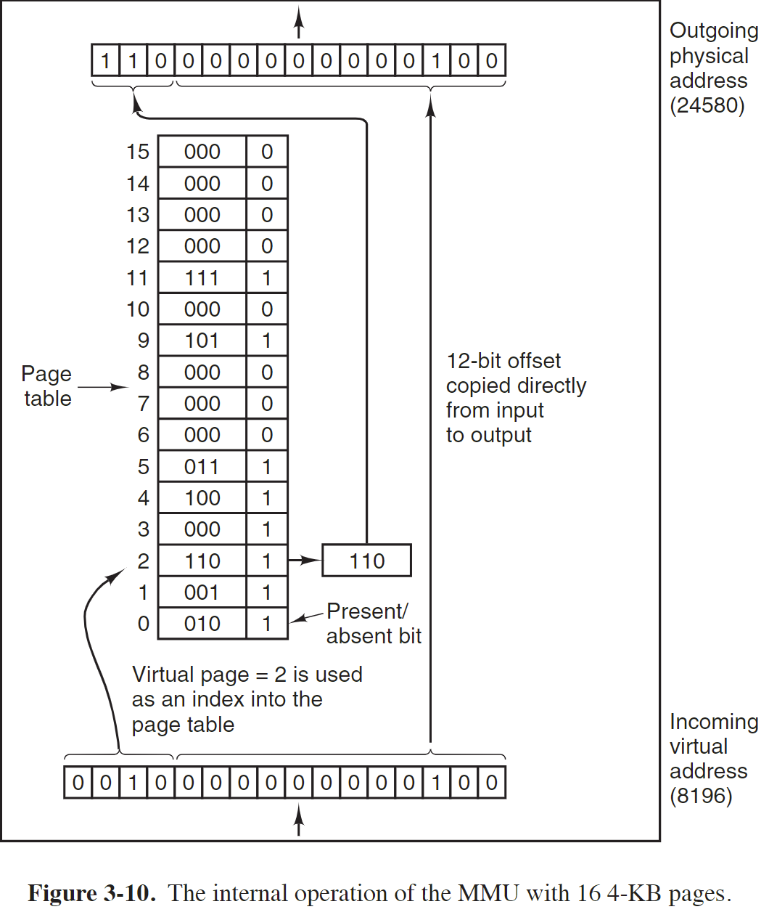
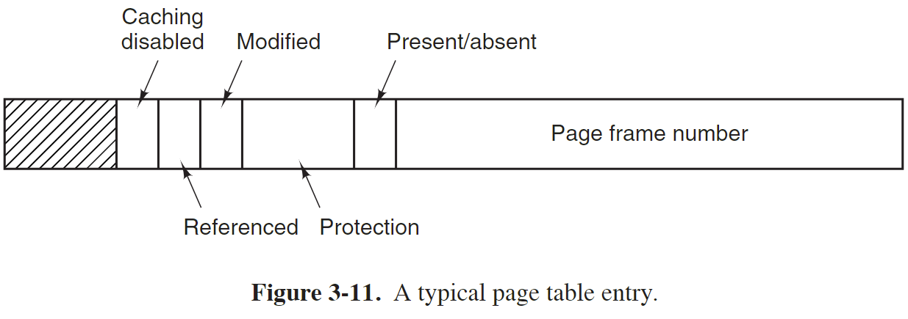
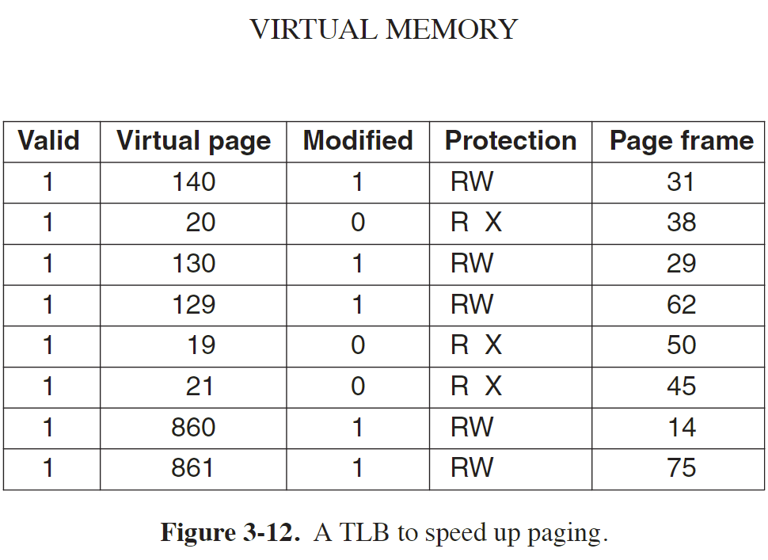
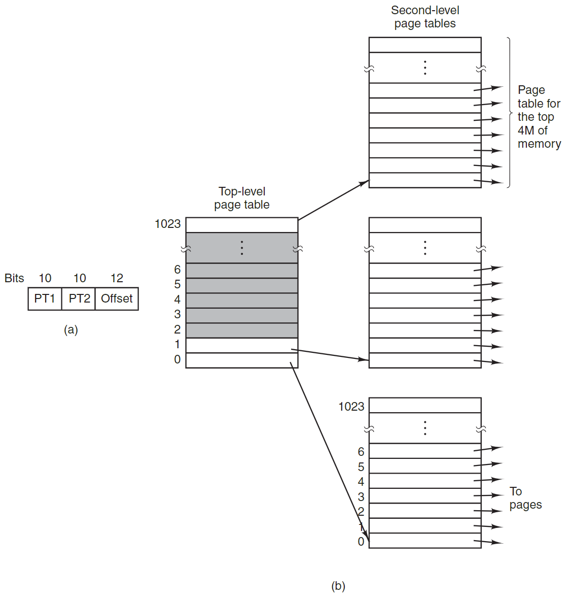
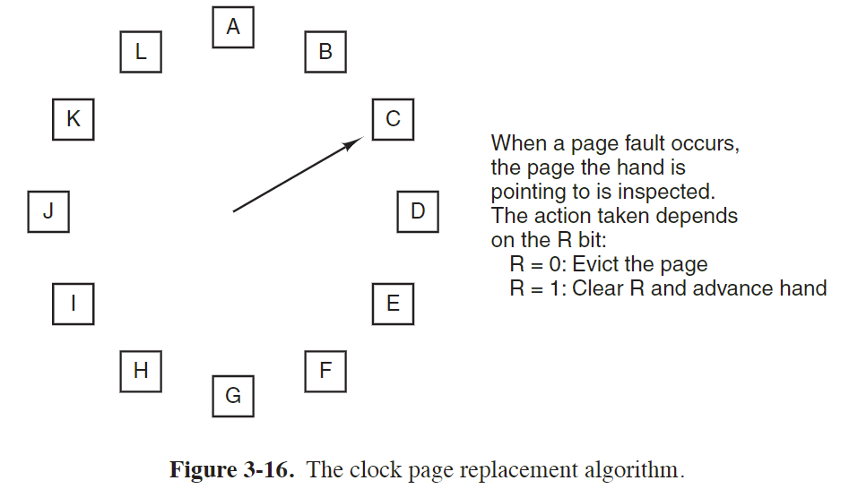
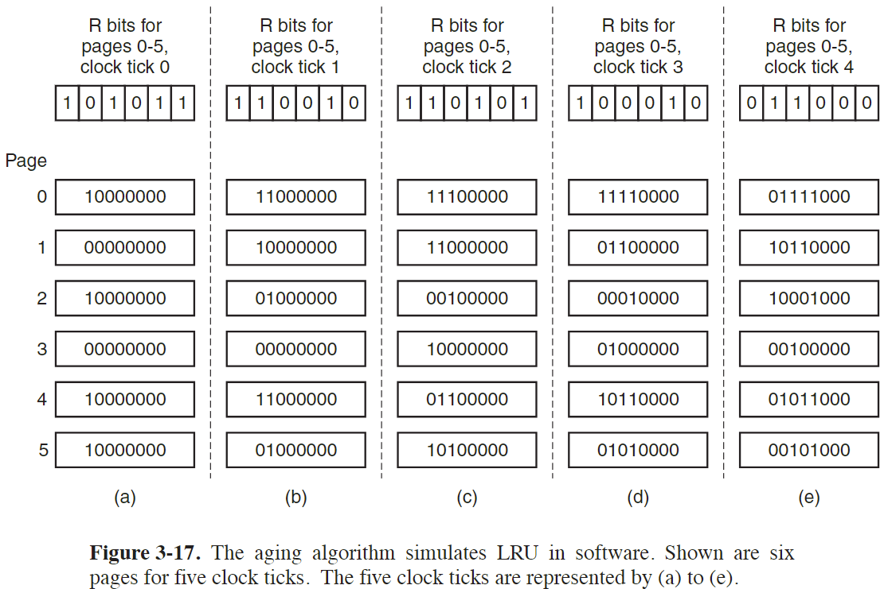

现代操作系统 第三章 内存管理

# 内存抽象 —— 地址空间
进程之间使用物理地址有下面缺陷：
- 如果让进程能访问内存的全部地址，可能对操作系统造成破坏，不安全
- 不能同时运行多个程序，因为地址可能冲突

因此对内存做了一个抽象，引入地址空间的概念：
The address space creates a kind of abstract memory for programs to live in. 
An address space is the set of addresses that a process can use to address memory.

地址空间需要做到的有：
- 限制进程对内存的访问，进程不能随意访问内存的全部地址
- 每个进程访问的实际物理地址不同，相互隔离

早期的解决方案：
- 使用 base 和 limit 寄存器
base 寄存器存放每个进程访问实际物理内存的起始地址，每个进程的起始地址不同
如某个进程的起始地址为 16384，而每个进程的虚拟地址空间相同，从 0 开始
如果该进程访问的虚拟地址为 28，则实际的物理地址为 16384+28
limit 寄存器定义每个进程访问的地址长度
这两个寄存器将不同进程访问的地址隔离开

- 缺点
每次访问内存都要做加法，而加法运算很慢
系统的进程越来越多，软件越来越大，地址不够用，且进程所占用的空间往往在运行过程中动态变化

# Swaping
随着系统运行的程序越来越多，内存不够用，此时有两种解决方案：
- Swaping
- Virtual Memory

Swaping 即是在内存不够用时，将部分内存 swap out to disk，然后将需要运行的程序从磁盘 swap in

缺点：
容易造成 multiple holes in memory，而将内存中的可用空间组合成一片大的空间，即 memory compaction 需要很长时间
进现在很多程序占的内存很大，且程序所需要的空间往往不是固的，而是在运行过程中动态变化，swap in 和 swap out 的时间很长

# Virtual Memory
虚拟内存是解决内存不足内存，而 swaping 方式太慢的一种方案

The basic idea behind virtual memory is that each program has its own address space, which is broken up into chunks called pages. 
Each page is a contiguous range of addresses. 
These pages are mapped onto physical memory, but not all pages have to be in physical memory at the same time to run the program.  

将每个进程的地址空间以页为单位划分，因此运行一个进程时，可以以页为单位，加载部分页到内存，在运行过程中根据需要加载页

## Paging
每个进程分配的是虚拟地址空间，虚拟地址经过 MMU（Memory Management Unit）将虚拟地址转换为实际的物理地址

The virtual address space consists of fixed-size units called **pages**. 
The corresponding units in the physical memory are called **page frames**.
The pages and page frames are generally the same size.

### MMU
- Memory Management Unit
- MMU 是 CPU 内的一个用于将虚拟地址转换为物理地址的硬件

### Page fault
通常虚拟地址空间比物理内存大，因此可能只有部分虚拟页和物理页有映射关系
MMU 中有一个 Present/absent 位来跟踪哪些虚拟地址有对应的物理页
当访问的虚拟地址无对应的物理页时，MMU causes the CPU to trap to the operating system. 
This trap is called a page fault.
然后操作系统会根据相应的算法选择一个 page frame，如果该页为脏页，即有数据修改，则先将该页的内容写回磁盘，
然后从磁盘获取需要的页更新到选择的 page frame，最后 restart the trapped instruction.

### Page table
The virtual address is split into a virtual page number (high-order bits) and an offset (low-order bits).

The virtual page number is used as an index into the page table to find the entry for that virtual page. 
From the page table entry, the page frame number (if any) is found. 
The page frame number is attached to the high-order end of the offset, replacing the virtual page number, to form a physical address that can be sent to the memory.
Thus, the purpose of the page table is to map virtual pages onto page frames.

见上图所示，虚拟地址中的高 4 位为 virtual page number，根据其值 2 找到 page table 中 index 为 2 的条目，
获取 page frame number 为 110，且其标志位 Present/absent 为 1 表示该页存在于物理内存中，
因此根据 page frame number 和虚拟页低 12 位的偏移量确定区里地址，虚拟地址和物理地址的偏移量相同，
偏移量代表查找数据在该页中的偏移，物理页和虚拟页大小相同，偏移量相同

#### Page Table Entry
The exact layout of an entry in the page table is highly machine dependent, but the kind of 
information present is roughly the same from machine to machine.

The disk address used to hold the page when it is not in memory is not part of the page table.

- Page frame number

- Present/absent
If this bit i 1, the entry is valid ad can be used.

- Protection
The protection bits tell what kinds of access are permitted.
0 for read/write and 1 for read only.

A more sophisticated arrangement is having 3 bits, one bit each for enabling reading, writing, and executing the page.

- Modified
When a page is written to, the hardware automatically sets the Modified bit.
if the page in it has been modified (i.e., is ‘‘dirty’’), it must be written back to the disk.
The bit is sometimes called the dirty bit, since it reflects the page’s state.

- Referenced
The Referenced bit is set whenever a page is referenced, either for reading or for writing.
Its value is used to help the operating system choose a page to evict when a page fault occurs.

- Caching disabled 
With this bit, caching can be turned off.

### Speeding Up Paging
In any paging system, two major issues must be faced:
1. The mapping from virtual address to physical address must be fast.
每次内存引用，都需要将虚拟地址转换为物理地址

2. If the virtual address space is large, the page table will be large.
每个进程都有自己的 page table

#### Translation Lookaside Buffers
为了实现 large and fast page mapping，在 MMU 内部增加了一个 TLB 的硬件

TLB consists of a small number of entries. 
Each entry contains information about one page for mapping virtual addresses to physical addresses 
without going through the page table.

TLB 其实是页表的一个缓存，将常用的一些页表条目缓存在 CPU 内存，减少到内存中查询页表的次数

#### Software TLB Management
对于硬件 TLB 管理：
TLB management and handling TLB faults are done entirely by the MMU hardware. 
Traps to the operating system occur only when a page is not in memory.

然而，有些机器，TLB 管理通过软件：
The TLB entries are explicitly loaded by the operating system. 
When a TLB miss occurs, instead of the MMU going to the page tables to find and fetch the needed page reference, it just generates a TLB fault and tosses the problem into the lap of the operating system.

The system must find the page, remove an entry from the TLB, enter the new one, and restart the instruction that faulted.

All of this must be done in a handful of instructions because TLB misses occur much more frequently than page faults.

因此，需要采取措施来 reduce TLB misses. 
有些操作系统会在执行一条指令时猜测接下来可能会需要用到的 entries 然后将其预先加载到 TLB 以减少 TLB misses.

different kind of misseses:
- soft miss
the page referenced id not in TLB, but is in memory.
- hard miss
the page is not in memory.
A hard miss is easily a million times slower than a soft miss.

Looking up the mapping in the page table hierarchy is known a a **page table walk**.

其他情况：
- The page may actually be in memory, but not in this process's page table
- The program accessed an invalid address
In this case, the operating system typically kills the program with a segmentation fault.

### Page Tables for Large Memories

#### Multiple Page Tables
The secret to the multilevel page table method is to avoid keeping all the page tables in memory all the time.
In particular, those that are not needed should not be kept around. 

以上图为例，为一个两级页表，32 位虚拟地址被划分为三个字段，10-bit PT1，10-bit PT2 和 12-bit Offset
由于 Offset 是 12 位，因此 page size 是 4KB

Suppose, for example, that a process needs 12 megabytes: 
the bottom 4 megabytes of memory for program text, 
the next 4 megabytes for data, 
and the top 4 megabytes for the stack. 
In between the top of the data and the bottom of the stack is a gigantic hole that is not used.

The entry located by indexing into the top-level page table yields the address
or the page frame number of a second-level page table. 
Entry 0 of the top-level page table points to the page table for the program text, 
entry 1 points to the page table for the data, 
and entry 1023 points to the page table for the stack. 
The other (shaded) entries are not used. 

The PT2 field is now used as an index into the selected second-level page table to find the page frame number for the page itself.

在该示例中，尽管虚拟地址空间包含很多页，但实际用到的只有 4 个页表，一个 top-level table，三个 second-level table
其他暂时未用到的 second-level table 可以不用创建，这些页对应的 top-level table 的条目中，将其Present/absent 位设置为 0
当访问到这些虚拟页时，触发 page fault 

多级页表可以扩展到三级、四级或更多级，如果上一级页表中某个条目为空，则该条目对应的下级页表未分配，不占空间

#### Inverted Page Table
倒排页表，将物理页作为索引查找对应的虚拟页，节省内存空间

### Page Replacement Algorithms
When a page fault occurs, the operating system has to choose a page to evict
(remove from memory) to make room for the incoming page. 

如果选择的页是脏页，则在覆盖前需要先将该页写到磁盘更新数据；
如果选择的页不是脏页，则可以直接覆盖该页的数据

如果选择的页使用频率很高，被覆盖后接下来又要用到，则又会触发 page fault，重新将该页从磁盘加载到内存

因此如何选择淘汰的页需要合适的 page replacement 算法

理想情况选择使用频率最低的页淘汰，但接下来会用到哪些页无法准确预知的

#### NRU 算法
- Not Recently Used Page Replacement Algorithm

每个页的条目中都有两个 status bit 来表示该页的状态，即 R 和 M：
- R is set whenever the page is referenced (read or written). 
该位会周期性的被清零，即一个周期的开始该位为 0，只有该时钟周期内该页被读或写，才会被置1
- M is set when the page is written to (i.e., modified)
一旦该页被修改，则置 1，不会清零

两个标志位有如下四种状态：
- Class 0: not referenced, not modified.
- Class 1: not referenced, modified.
这种状态也存在，表示该页之前被修改，但本时钟周期内未被读
- Class 2: referenced, not modified.
- Class 3: referenced, modified.

如果发生 page fault，NRU 算法会从 class 最低的一类页种随机选择一个页淘汰

NRU算法的优点是简单易实现，适用于具有较低页面访问频率和较少页面修改的场景。
然而，NRU算法可能会导致较高的错误率，因为它只关注页面的访问和修改情况，并没有完整地考虑页面的访问模式和重要性。

#### FIFO 算法
- First-In, First-Out

The operating system maintains a list of all pages currently in memory, 
with the most recent arrival at the tail and the least recent arrival at the head. 
On a page fault, the page at the head is removed and the new page added to the tail of the list

FIFO算法的缺点是它无法考虑页面的访问频率和重要性。
仅根据进入内存的时间来淘汰，可能淘汰使用频率较高的页

#### The Second-Chance Page Replacement Algorithm
- FIFO 的改进

在 FIFO 的基础上，淘汰时再参考 R 状态位的值，
根据进入内存的时间排序后，如果要淘汰的页 R 位为 0，则表示该页是 old and unused，因此淘汰
如果选择的页 R 位为 1，则将 R 位清零，然后将该页移到链表的末尾，将其看作刚进入内存的页，然后继续寻找下一个页筛选

如果所有的页都被访问过，则该算法会将每个页的 R 位都清零，再移到链表末尾，最后又变成 FIFO

#### The Clock Page Replacement Algorithm
将页形成一个环状的链表，类似时钟

当需要进行页面置换时，算法按照时钟顺序扫描页面，并选择第一个 R 位为 0 的页面进行替换

#### LRU 算法
- Least Recently Used

It is necessary to maintain a linked list of all pages in memory, 
with the most recently used page at the front and the least recently used page at the rear. 

The difficulty is that the list must be updated on every memory reference. 
Finding a page in the list, deleting it, and then moving it to the front is a very time consuming operation, even in hardware (assuming that such hardware could be built).

很难实现

#### NRU
- Not Frequently Used

每个页面都有一个计数器，记录页面被访问的次数。
当需要进行页面置换时，NFU算法选择计数器值最低的页面进行替换，即选择访问次数最少的页面。
这样做的目的是将访问频率较低的页面置换出去，以腾出空间来存放访问频率较高的页面。

这种算法可能不准确，如某个页在过去一段时间经常被访问，最近没有访问，但其统计次数处于高位，不会被置换

#### Aging
NRU 算法的改进
在Aging算法中，每个页面都有一个计数器，通常是一个比特位向量。计数器的长度与系统时钟中断的频率相关，通常每个时钟中断周期都会更新一次计数器。在每次更新时，计数器中的每一位都右移一位，并根据页面的访问情况进行更新。

#### The Working Set Page Replacement Algorithm
- working set
The set of pages that a process is currently using is its working set.

- trashing
A program causing page faults every few instructions is said to be trashing.

- prepaing
Loading the pages before letting processes run is also called prepaging.

Working Set Page Replacement（工作集页面置换）算法是一种基于进程工作集概念的页面置换算法，旨在提高系统性能和减少页面置换的开销。该算法通过跟踪进程对内存中页面的实际使用情况来决定页面的置换。

工作集是指进程在一段时间内实际使用的页面集合，它反映了进程当前对内存中的哪些页面具有活跃的访问需求。
Working Set算法的目标是保留进程的工作集中的页面，并置换掉不属于工作集的页面，以减少页面置换带来的性能损失。

1. 定义工作集窗口大小：首先，需要确定用于跟踪工作集的窗口大小。工作集窗口是一个时间窗口或页面访问次数窗口，用于限定跟踪工作集的范围。窗口大小可以根据系统需求和性能进行调整。

2. 跟踪页面访问：当进程访问一个页面时，记录下该页面的标识符，并将其加入当前的工作集。可以通过硬件机制、操作系统或页面置换算法来实现页面访问的跟踪。

3. 检查工作集：定期检查工作集中的页面，将工作集窗口之外的页面标记为可置换的。具体而言，对于每个页面，检查其最后一次访问时间或访问次数，并与工作集窗口进行比较。如果页面不在工作集窗口内，即不属于当前工作集，那么将其标记为可置换的。

4. 页面置换：当需要进行页面置换时，从可置换的页面中选择一个进行替换。常见的选择策略包括最久未使用（LRU）等。
   选择的依据是选择对系统性能影响最小的页面进行置换。

Working Set算法的核心思想是保留进程的工作集中的页面，因为它们是当前活跃的页面，可能在近期内会再次被访问。
这样可以减少页面置换的次数，提高系统的性能和响应速度。

然而，Working Set算法也存在一些挑战和限制。 其中一个挑战是确定合适的工作集窗口大小。
如果窗口过小，可能无法准确捕捉到进程的活跃页面集合； 而如果窗口过大，可能导致过多的页面保留在内存中，浪费资源。
另外，Working Set算法对于多任务环境和抢占式调度可能需要额外的考虑和改进。

