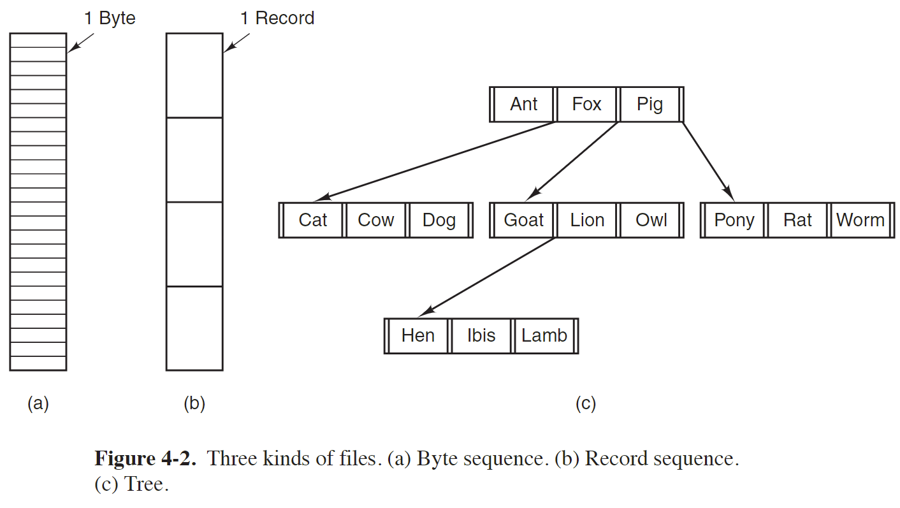
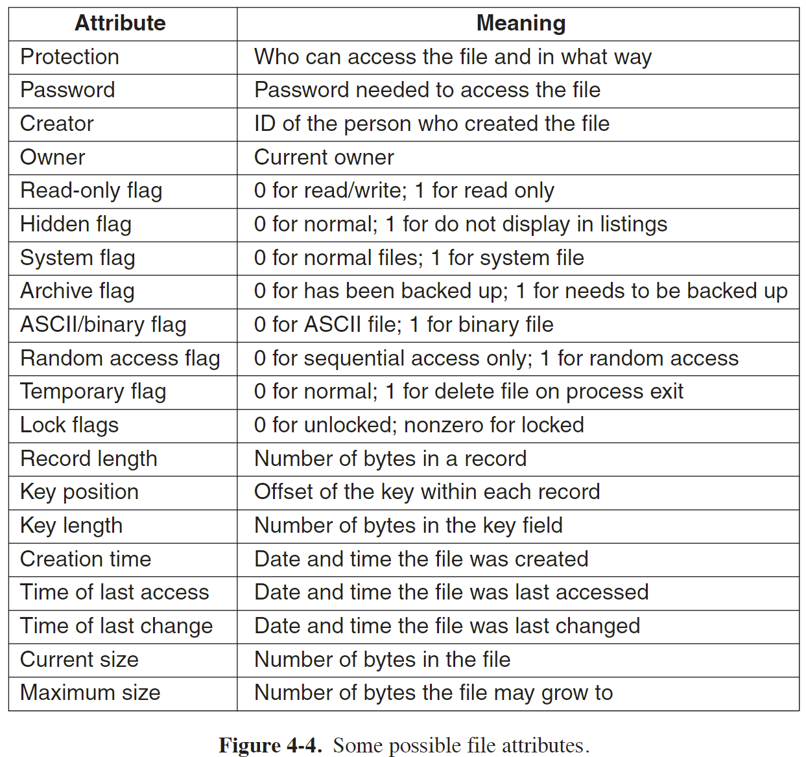
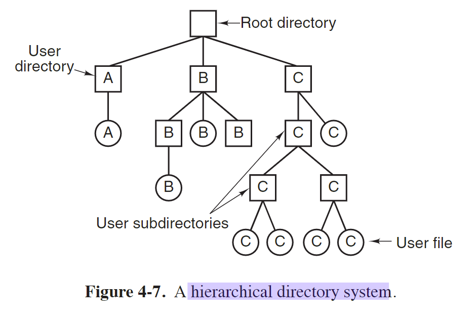
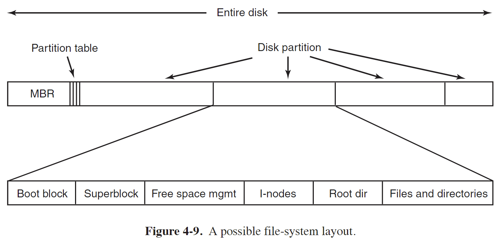
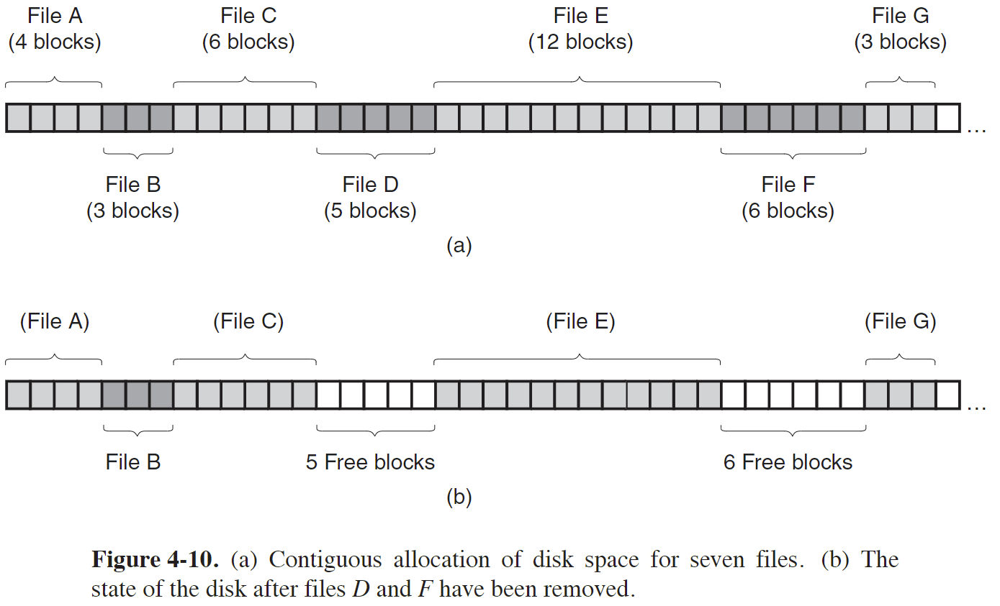
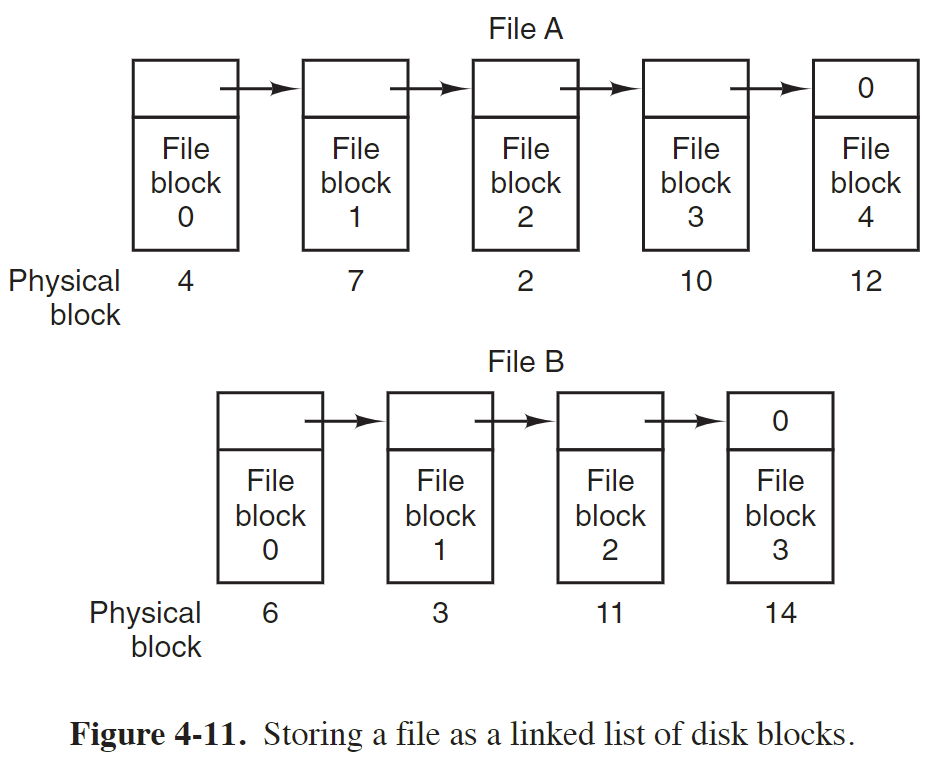
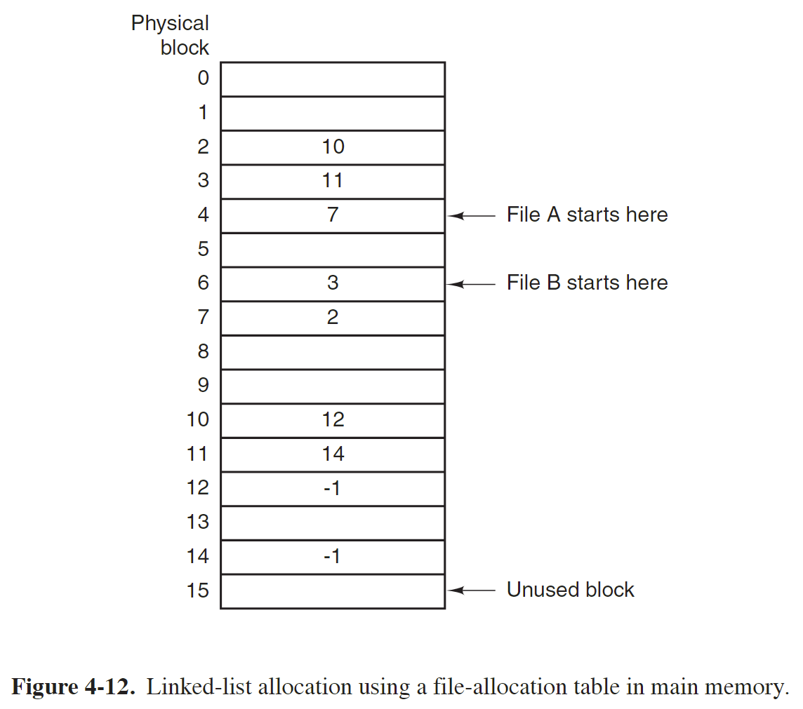
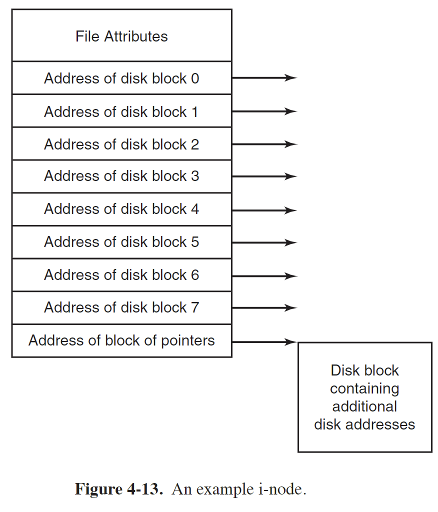
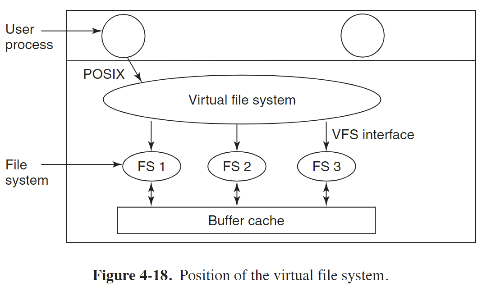

现代操作系统 第四章 文件系统

# 文件
A file is an abstraction mechanism. 
It provides a way to store information on the disk and read it back later

## 文件命名
不同系统文件命名规则可能不同，大多数文件系统支持文件名长达 255 字符

有些文件系统的文件名区分大小写，有些不区分，linux 中区分大小写，windows 不区分

## 文件结构
Files can be structured in any of several ways. 
Three common possibilities are depicted in Fig. 4-2. 
The file in Fig. 4-2(a) is an unstructured sequence of bytes.
In effect, the operating system does not know or care what is in the file. All it sees are bytes. 
Any meaning must be imposed by user-level programs. Both UNIX and Windows use this approach.

Having the operating system regard files as nothing more than byte sequences provides the maximum amount of flexibility. 
User programs can put anything they want in their files and name them any way that they find convenient.

## 文件类型

### Regular file
Regular files are the ones that contain user information. 

Regular files are generally either ASCII files or binary files. 

ASCII files consist of lines of text. 
In some systems each line is terminated by a carriage return character. 
In others, the line feed character is used. 
Some systems (e.g., Windows) use both. 

文本文件和二进制文件在存储和表示数据的方式上有所不同。

文本文件是以纯文本形式存储的文件，其中的数据由字符组成，使用特定的字符编码（如ASCII、UTF-8等）表示。文本文件通常包含可读的文本内容，例如文章、配置文件、源代码等。在文本文件中，每个字符都有对应的字符编码值，这些字符编码值可以被解释为文本内容。

二进制文件则以二进制形式存储的文件，其中的数据由字节组成，可以包含任意的数据，包括文本、图像、音频、视频等。二进制文件不以字符编码表示数据，而是直接使用字节表示。二进制文件可以包含非文本数据，如图像文件中的像素值、音频文件中的采样数据等。

虽然文本文件最终在计算机上以二进制数据的形式存储，但文本文件与二进制文件的区别在于数据的表示和解释方式。文本文件使用字符编码将二进制数据解释为可读的文本内容，而二进制文件则不以字符编码解释数据，而是根据特定的文件格式和应用程序来解释数据。

总结起来，文本文件是以字符编码表示的可读文本内容，而二进制文件是以字节形式存储的任意数据。尽管最终在计算机上存储的数据都是以二进制形式表示，但文本文件和二进制文件的区别在于数据的解释方式和处理方式。

### Directory
Directories are system files for maintaining the structure of the file system. 

### Character special files
Character special filesare related to input/output and used to model serial I/O devices, such as terminals, printers, and networks. 

### Block special file
Block special files are used to model disks. In this chapter we will be primarily interested in regular files.

## 访问文件
Early operating systems provided only one kind of file access: sequential access.
早期操作系统只能按顺序访问文件，类似磁带，可以倒带，但按照顺序，不能随机访问

现在操作系统用磁盘作为存储媒介，可以随机访问文件

## 文件属性
文件的属性，即文件的元数据，是除了文件名和文件中的数据之外的一些信息，如文件创建时间、修改时间、文件大小等
不同系统文件的属性不同，下图中列出可能的一些文件属性：

## 文件操作
- Create
The file is created with no data. 
The purpose of the call is to announce that the file is coming and to set some of the attributes.

- Delete

- Open
Before using a file, a process must open it. 
The purpose of the open call is to allow the system to fetch the attributes and list of disk addresses into main memory for rapid access on later calls.

- Close
When all the accesses are finished, the attributes and disk addresses are no longer needed, so the file should be closed to free up internal table space.

Many systems encourage this by imposing a maximum number of open files on processes.

- Read
The caller must specify how many data are needed and must also provide a buffer to put them in.

- Write

- Append

- Seek
seek repositions the file pointer to a specific place in the file. 
After this call has completed, data can be read from, or written to, that position.

- Get attributes

- Set attributes

- Rename

# 目录
To keep track of files, file systems normally have directories or folders, which are themselves files.

## hierarchical directory system

## 目录操作
- Create
A directory is created. It is empty except for dot and dotdot, which are put there automatically by the system (or in a few cases, by the mkdir program).

- Delete

- Opendir
Before a directory can be read, it must be opened, analogous to opening and reading a file.

- Closedir
When a directory has been read, it should be closed to free up internal table space.

- Readdir

- Rename

- Link

- Unlink

# 文件系统
- 文件系统是操作系统使用的一种结构，用于在磁盘上组织文件和目录，并记录文件的位置、大小、权限等元数据。
- 文件系统是为了方便管理和组织硬盘上的数据，并提供对文件的读写、访问控制等功能。
- 一个分区只能创建一个文件系统
- 一个硬盘可以划分不同分区，每个分区可以使用不同的文件系统
	- 例如安装多操作系统，不同分区安装不同操作系统，从而使用不同的文件系统
	- 不同分区创建不同的文件系统用于管理不同类型的文件
      例如，在一个硬盘上创建一个ext4文件系统的分区用于存储系统文件和应用程序，
	  然后创建一个XFS文件系统的分区用于存储大量的媒体文件。

- `man fs` 查看文件系统说明

## 文件系统的作用
1. 数据组织：文件系统定义了文件和目录在磁盘上的结构，使得文件可以进行逻辑上的组织和存储。

2. 访问控制：文件系统通过权限机制确定哪些用户或进程有权限读取或修改文件内容。

3. 文件定位：文件系统提供了文件路径的机制，方便用户通过路径来访问和定位文件。

## 不同文件系统的区别
不同的文件系统采用不同的数据结构和算法来管理数据。
常见的Linux文件系统包括Ext4、XFS、Btrfs等。 这些文件系统在读写文件时可能有以下区别：

1. 性能特性：不同文件系统的性能特点各不相同。某些文件系统可能更适合大型文件的读写操作，而某些文件系统可能更适合处理小文件和元数据。

2. 容量限制：不同文件系统对支持的最大文件大小、分区大小等有不同的限制。

3. 日志和元数据写入：一些文件系统具有日志功能，可以记录文件系统操作，提高数据的完整性和一致性。而其他文件系统可能采用不同的元数据写入策略。

4. 数据压缩和加密：某些文件系统提供数据压缩和加密的特性，以减少磁盘空间占用和增加数据的安全性。

综上所述，不同文件系统有不同的特性和性能表现，选择合适的文件系统取决于具体的需求和应用场景。

## File-System Layout
磁盘的第一个扇区，即 sector 0 叫 MBR (Master Boot Record) and is used to boot the computer.

MBR 有 512 字节，前 446 字节防止启动引导程序，后 64 字节为分区表（partition table），记录整个硬盘的分区状态，最后 2 字节为 55AA，标识位

分区表记录了每个分区的起始和结束位置

MBR 的第一个 block 为 boot block，用于加载内核文件

为了统一，每个分区即使不包含启动引导程序，其开始位置都有 boot block

不同系统磁盘分区的结构有差异，但通常会包含下图的结构

superblock 会包含文件系统的全部关键参数，如文件系统类型，块数量等，在系统启动后会被读到内存中

# Implementing Files
> [文件的存储](https://xiaolincoding.com/os/6_file_system/file_system.html#文件的存储)

Probably the most important issue in implementing file storage is keeping track of which disk blocks go with which file.

## Contiguous Allocation
连续分配，文件存放在磁盘的连续块中

优点：
实现简单
读性能高

缺点：
容易产生碎片
需要创建文件时知道文件的大小，且文件后期不易扩展

## Linked-List Allocation
链式分配，组成文件的 block 通过链表连接

优点：
避免连续分配方案产生的外部碎片问题

缺点：
读操作性能差
每个 block 的前几个字节用来存放指向下一个 block 的指针，占用空间

### Linked-List Allocation Using a Table in Memory
内存中维护一个 FAT（File allocation table），用来存放每个文件占用的物理块信息

根据上图所示，文件 A 起始块为 4，下一个块为 7，接着依次为 2 10 12

优点：
提高检索速度

缺点：
FAT 占内存，不适合大磁盘使用

### I-nodes
每个文件有一个 i-node 的数据结构，即索引节点，保存文件的属性和文件块的磁盘地址信息

优点：
当使用某个文件时，才将对应的 i-node 加载到内存，且其比 FAT 占用内存小

缺点：
当文件过大，索引节点无法存放全部文件信息时不好处理

# Implementing Directories
The directory entry provides the information needed to find the disk blocks.

A closely related issue is where the attributes should be stored. 

For systems that use i-nodes, another possibility for storing the attributes is in the i-nodes, rather than in the directory entries. 
In that case, the directory entry can be shorter: just a file name and an i-node number. 

# Virtual File Systems
文件系统种类很多，即使一个操作系统中，不同分区也可能使用不同的文件系统
为了文件系统对用户透明，采用一个虚拟文件系统 VFS（virtual file system）的概念

The key idea is to abstract out that part of the file system that is common to all file systems and put that code in a separate layer that calls the underlying concrete file systems to actually manage the data. 

对于用户而言，不用关系底层用的文件系统，VFS 提供统一的接口给用户

如上图所示， VFS 给用户提供上层接口，即 POSIX 接口，用户通过调用标准 POSIX 接口函数，如 open，read 等访问文件
VFS 还有底层接口，和真实的文件系统对接

