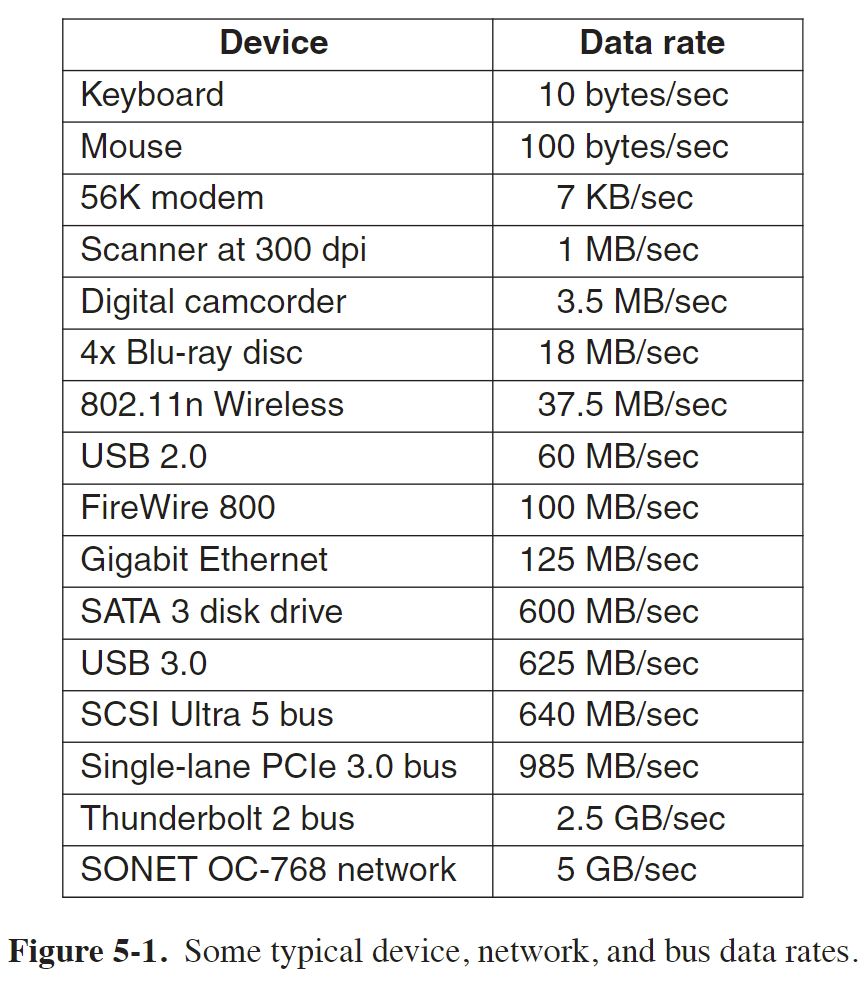
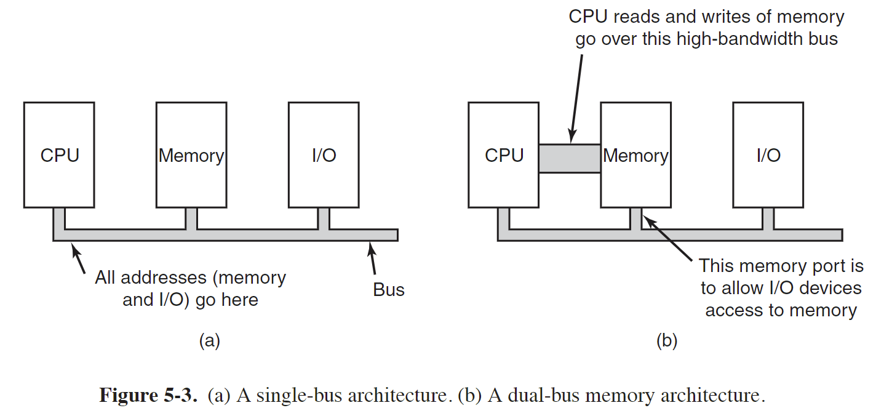
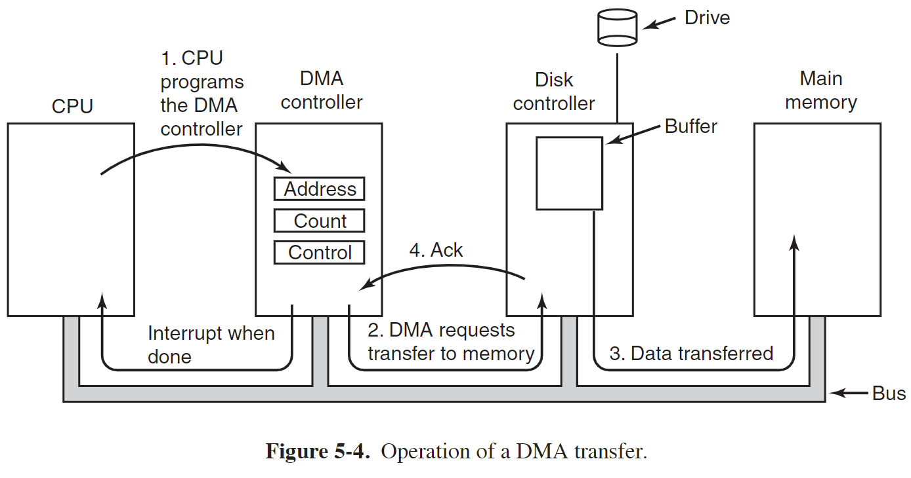
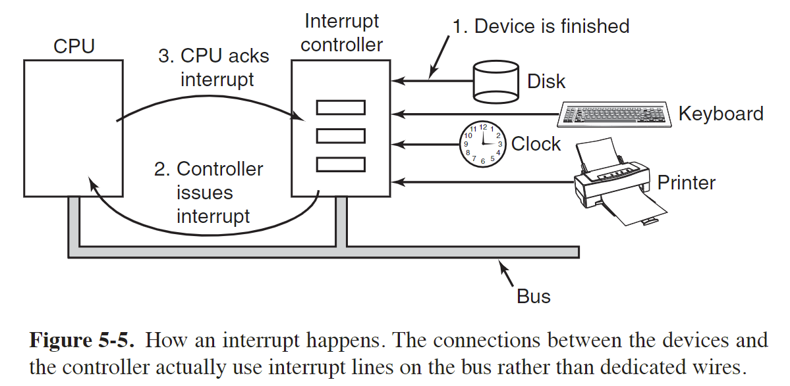
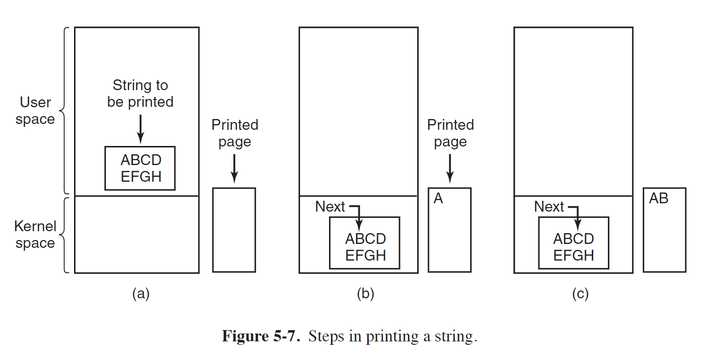
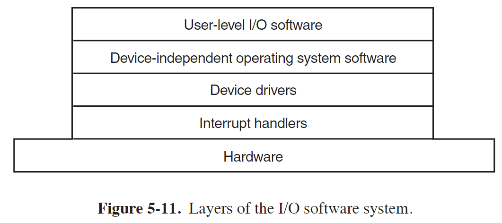
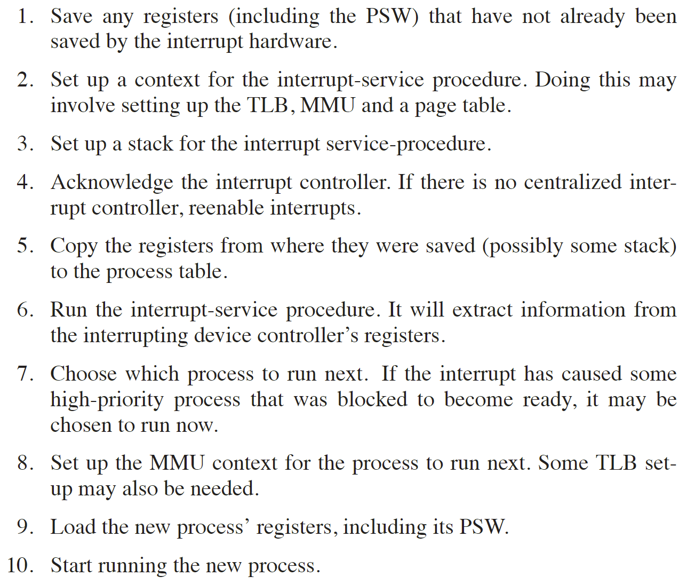
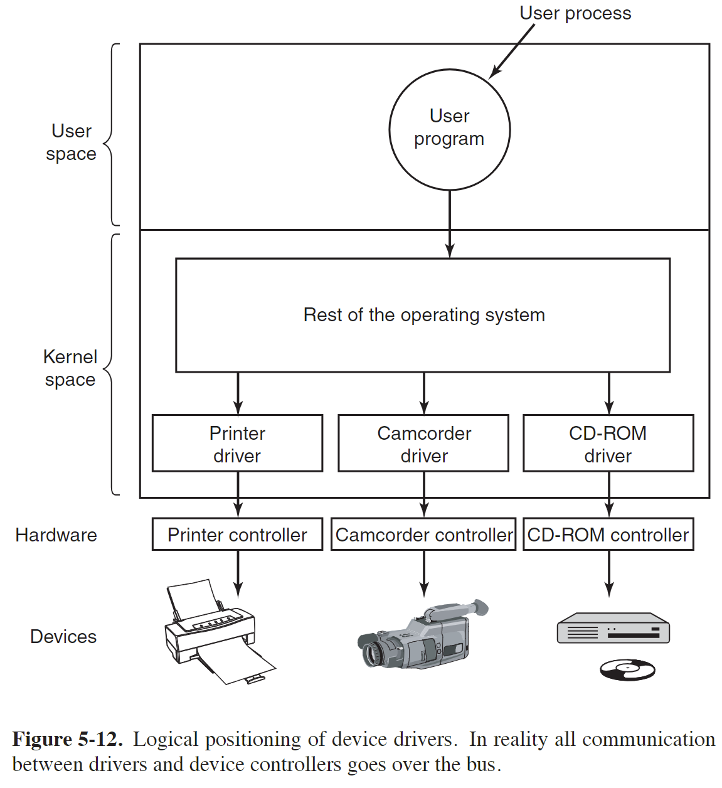
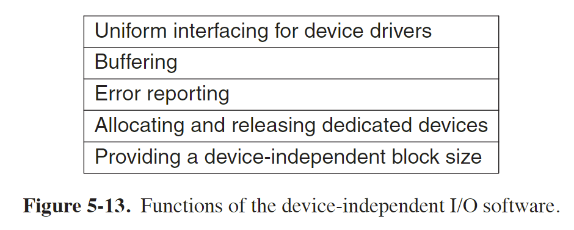

现代操作系统 第五章 输入/输出

# I/O 硬件
I/O devices cover a huge range in speeds, which puts considerable pressure on the software to perform well over many orders of magnitude in data rates.

## I/O 设备文件类型
I/O 设备大致可以分为两类
Both block and character devices provide an interface between the user space applications and the underlying hardware or kernel services. 
They allow programs to read from and write to the devices in a standardized way, abstracting away the complexities of the underlying hardware implementation.

### 块设备
- Block devices represent devices that allow access to data in fixed-sized blocks, typically used for storage devices like hard disks, SSDs, and USB drives.
- They are accessed in terms of block I/O operations and seem to be a continuous stream of data.
- Block devices are capable of random access, meaning you can read/write data at any position within a block without the need to read the entire block.
- Examples of block devices include `/dev/sda` (hard disk), `/dev/sdb` (USB drive), and `/dev/nvme0n1` (NVMe storage device).
- Block device files have a type identifier "b" in the permissions section of the `ls -l` command output.

### 字符设备
- Character devices represent devices that can be accessed as a stream of characters, indicating a sequential flow of data.
- They typically handle devices that require input or output of data character by character, such as serial ports, terminals, or devices that deal with keyboard/mouse input.
- Character devices are accessed through byte-by-byte I/O operations.
- They generally don't support random access and operate with a stream of characters.
- Examples of character devices include `/dev/tty` (terminal), `/dev/null` (null device), and `/dev/urandom` (random number generator).
- Character device files have a type identifier "c" in the permissions section of the `ls -l` command output.
- Printers, network interfaces, mice (for pointing), rats (for psychology lab experiments), and most other devices
that are not disk-like can be seen as character devices.

## Device Controller
I/O units often consist of a mechanical component and an electronic component. 

It is possible to separate the two portions to provide a more modular and general design. 

The electronic component is called the device controller or adapter. 
On personal computers, it often takes the form of a chip on the parentboard or a printed circuit card that can be inserted into a (PCIe) expansion slot.

The mechanical component is the device itself. 

## Memory-Mapped I/O
Each controller has a few **registers** that are used for communicating with the CPU. 

By **writing** into these registers, the operating system can command the device to deliver data, accept data, switch itself on or off, or otherwise perform some action. 

By **reading** from these registers, the operating system can learn what the device’s state is, whether it is prepared to accept a new command, and so on.

In addition to the control registers, many devices have a **data buffer** that the operating system can read and write. 

For example, a common way for computers to display pixels on the screen is to have a video RAM, which is basically just a data buffer, available for programs or the operating system to write into.

The issue thus arises of how the CPU communicates with the control registers and also with the device data buffers. 
1. each control register is assigned an I/O port number, an 8- or 16-bit integer 
早期使用

2. map all the control registers into the memory space
Each control register is assigned a unique memory address to which no memory is assigned. 
This system is called memory-mapped I/O. 
In most systems, the assigned addresses are at or near the top of the address space. 

3. hybird scheme
with memory-mapped I/O data buffers and separate I/O ports for the control registers

****************

The trend in modern personal computers is to have a dedicated high-speed memory bus 

The bus is tailored to optimize memory performance, with no compromises for the sake of slow I/O devices. 
x86 systems can have multiple buses (memory, PCIe, SCSI, and USB).

The trouble with having a separate memory bus on memory-mapped machines is that the I/O devices have no way of seeing memory addresses as they go by on the memory bus, so they have no way of responding to them. 

1. One possibility is to first send all memory references to the memory. If the memory fails to respond, then the CPU tries the other buses.

2. A second possible design is to put a snooping device on the memory bus to pass all addresses presented to potentially interested I/O devices.

3. A third possible design is to filter addresses in the memory controller.
In that case, the memory controller chip contains range registers that are preloaded at boot time.
The disadvantage of this scheme is the need for figuring out at boot time which memory addresses are not really memory addresses.

## Direct Memory Access
No matter whether a CPU does or does not have memory-mapped I/O, it needs to address the device controllers to exchange data with them.

The operating system can use only DMA if the hardware has a DMA controller, which most systems do.

DMA，即直接内存访问（Direct Memory Access）是一种计算机系统中用于高效地传输数据的技术。
通常情况下，当计算机的 CPU 需要从内存中读取或写入数据时，它通过总线进行传输。
在传统的 CPU 控制下，数据的传输需要经过 CPU 的介入，这会占用 CPU 的时间和资源。

DMA 技术的引入可以绕过 CPU，直接在主存和外设之间进行数据传输，从而提高数据传输的效率。
DMA 控制器是 DMA 技术的关键组成部分，它是一个独立的硬件设备，具有自己的寄存器和逻辑电路。
DMA 控制器能够在不占用 CPU 的情况下执行数据传输操作。

使用 DMA 技术进行数据传输的过程如下：

1. CPU 配置 DMA 控制器：CPU 首先将 DMA 控制器配置为执行特定的数据传输操作。这包括指定数据传输的起始地址、目标地址、传输的数据量和传输方向等参数。

2. DMA 控制器请求总线控制权：DMA 控制器向系统总线控制器发送请求，请求获取对系统总线的控制权。

3. CPU 授予总线控制权：如果系统总线空闲，CPU 将授予 DMA 控制器对总线的控制权。

4. DMA 控制器执行数据传输：一旦获得总线控制权，DMA 控制器将直接从起始地址读取数据并将其传输到目标地址，或者从目标地址读取数据并将其传输到起始地址。

5. 数据传输完成：当数据传输完成后，DMA 控制器将释放总线控制权，并通过中断或其他机制通知 CPU。

DMA 技术的应用广泛，特别适用于需要大量数据传输的任务，例如磁盘操作、网络数据传输和音频/视频处理等。
通过使用 DMA 技术，可以减少 CPU 的负载，提高系统的响应速度和吞吐量。

***********

许多总线有两种传输模式：word-at-a-time mode 和 block mode，有些 DMA 控制器也有这两种模式中的一种
1. 逐字模式
DMA 控制器以 word 为单位传输数据
The mechanism is called cycle stealing because the device controller sneaks in and steals an occasional bus cycle from the CPU once in a while, delaying it slightly.

2. 块模式
The DMA controller tells the device to acquire the bus, issue a series of transfers, then release the bus. 
This form of operation is called burst mode.

这种模式更有效率，因为一次传输的数据更多
但如果传输的块很大，可能阻塞 CPU 和其他设备

****************

上面介绍的 DMA 控制器让设备控制器将数据直接传输到主存为 fly-by mode
另一种模式，即 DMA 控制器让设备控制器将数据传输给 DMA 控制器，然后再传输到要传输的目标位置，这种方式更灵活，可以直接在设备和设备直接传输数据，或者内存和内存之间传输数据

大多数 DMA 控制器使用物理地址进行传输，因此操作系统需要将虚拟地址转换为物理地址写入到 DMA 控制器的地址寄存器中

****************
The disk first reads data into its internal buffer before DMA can start. 
磁盘先将数据存到磁盘控制器的缓存中而非直接存到内存中的原因如下：
1. the disk controller can verify the checksum before starting a transfer

2. the DMA transfer to memory is not time critical
If the bus were very busy, the controller might end up storing quite a few words and having a lot of administration to do as well. 
When the block is buffered internally, the bus is not needed until the DMA begins

*************
Not all computers use DMA. The argument against it is that the main CPU is often far faster than the DMA controller and can do the job much faster (when the limiting factor is not the speed of the I/O device). 

## 中断
When an I/O device has finished the work given to it, it causes an interrupt (assuming that interrupts have been
enabled by the operating system). 
It does this by asserting a signal on a bus line that it has been assigned. 
This signal is detected by the interrupt controller chip on the parentboard, which then decides what to do.

因为可能有很多 I/O 设备发送中断信号，因此 the controller puts a number on the address lines specifying which device wants attention and asserts a signal to interrupt the CPU.

The number on the address lines is used as an **index** into a table called the **interrupt vector** to fetch a new program counter. 
This program counter points to the start of the corresponding interrupt-service procedure. 
Typically **traps** and **interrupts** use the same mechanism from this point on, often sharing the same interrupt vector. 
The location of the interrupt vector can be hardwired into the machine or it can be anywhere in memory, with a CPU register (loaded by the operating system) pointing to its origin.

# I/O 软件实现
A key concept in the design of I/O software is known as **device independence**.
What it means is that we should be able to write programs that can access any I/O device without having to specify the device in advance.
例如一个程序能从硬盘、USB 和 DVD 设备读文件，不用因为设备不同而对程序做修改

Closely related to device independence is the goal of **uniform naming**. 
The name of a file or a device should simply be a string or an integer and not depend on the device in any way. 
例如 linux 中，所有的设备最终都对应一个文件，不同的文件或设备访问方式相同，都是通过其所在的路径名

Another important issue for I/O software is **error handling**. 
In general, errors should be handled as close to the hardware as possible. 
If the controller discovers a read error, it should try to correct the error itself if it can.

Still another important issue is that of **synchronous** (blocking) vs. **asynchronous** (interrupt-driven) transfer.
Most physical I/O is asynchronous—the CPU starts the transfer and goes off to do something else until the interrupt arrives.
However, some very high-performance applications need to control all the details of the I/O, so some operating systems make asynchronous I/O available to them.

Another issue for the I/O software is **buffering**.
Often data that come off a device cannot be stored directly in their final destination.
For example, when a packet comes in off the network, the operating system does not know where to put it until it has stored the packet somewhere and examined it.

The final concept that we will mention here is sharable vs. dedicated devices.
Some I/O devices, such as disks, can be used by many users at the same time.
Other devices, such as printers, have to be dedicated to a single user until that user is finished.

## Programmed I/O

In programmed I/O, the CPU executes program instructions to transfer data between itself and the I/O device. 
The CPU initiates the I/O operation by issuing commands and status queries to the I/O device through specific I/O ports or memory-mapped registers. 
The CPU then waits for the I/O device to complete the operation and signal the status back.

Programmed I/O is simple but has the disadvantage of tying up the CPU full time until all the I/O is done. 

## Interrupt-Driven I/O
When the printer has printed the character and is prepared to accept the next one, it generates an interrupt. 
This interrupt stops the current process and saves its state. 
Then the printer interrupt-service procedure is run.

不同于 programmed I/O，在打印机打印一个字符时，CPU 不再等待而是通过中断去处理其他事

## I/O Using DMA
An obvious disadvantage of interrupt-driven I/O is that an interrupt occurs on every character. 
Interrupts take time, so this scheme wastes a certain amount of CPU time. 

Interrupt-Driven I/O 会导致中断太频繁，每打印一个字符就中断，而中断也会花时间

Here the idea is to let the DMA controller feed the characters to the printer one at time, without the CPU being bothered. 
In essence, DMA is programmed I/O, only with the DMA controller doing all the work, instead of the main CPU.

# I/O Software Layers 
The functionality and interfaces differ from system to system, so the discussion that follows, which examines all the layers starting at the bottom, is not specific to one machine.

## Interrupt Handlers 
中断处理程序的主要作用是响应和处理中断事件，执行相应的操作以满足中断事件的需求。
它通常由操作系统内核或设备驱动程序编写，并在操作系统的上下文中执行。

不同机器处理过程不一定相同，通常包含下面步骤：

## Device Drivers
Each I/O device attached to a computer needs some device-specific code for controlling it. 
This code, called the device driver, is generally written by the device’s manufacturer and delivered along with the device.

Each device driver normally handles one device type, or at most, one class of closely related devices

In order to access the device’s hardware, actually, meaning the controller’s registers, the device driver normally has to be part of the operating system kernel, at least with current architectures. 

操作系统通常将驱动划分为一些种类，如 block 设备，字符设备
大多数操作系统为块设备驱动和字符设备驱动定义了一些标准的通用接口

许多设备驱动有相似的结构
- 设备启动时检查输入参数是否有效
- 检查设备当前是否在使用中
- Controlling the device means issuing a sequence of commands to it. 
  The driver is the place where the command sequence is determined, depending on what has to be done. 
  After the driver knows which commands it is going to issue, it starts writing them into the controller’s device register.

In a hot-pluggable system, devices can be added or removed while the computer is running.

Drivers are not allowed to make system calls, but they often need to interact with the rest of the kernel. 
Usually, calls to certain kernel procedures are permitted.

## Device-Independent I/O Software
The exact boundary between the drivers and the device-independent software is system (and device) dependent, because some functions that could be done in a device-independent way may actually be done in the drivers, for efficiency or other reasons.

