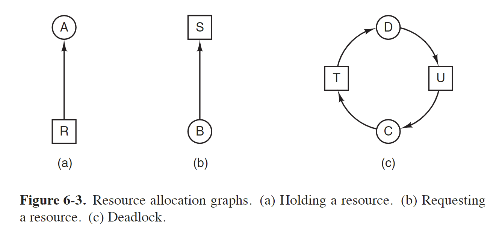
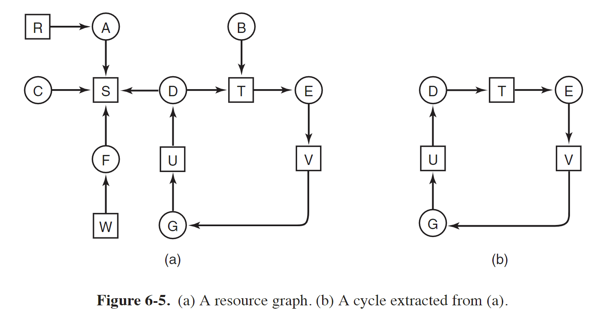
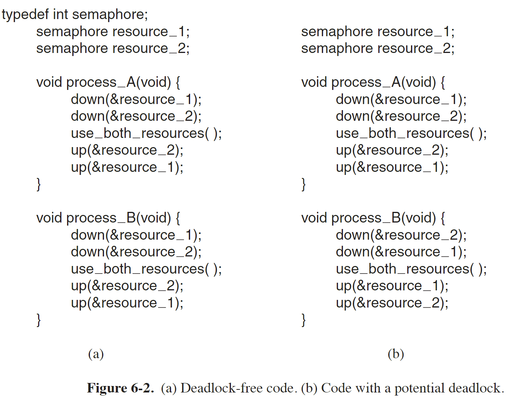
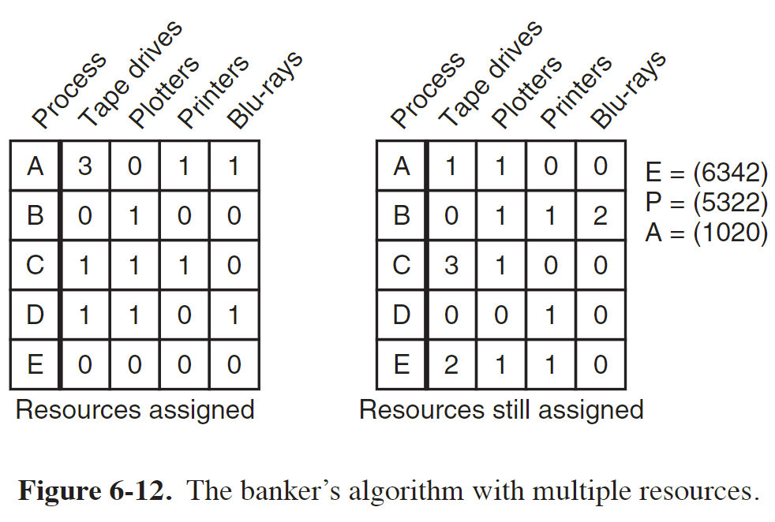
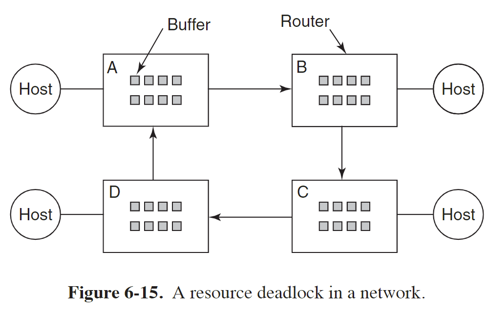
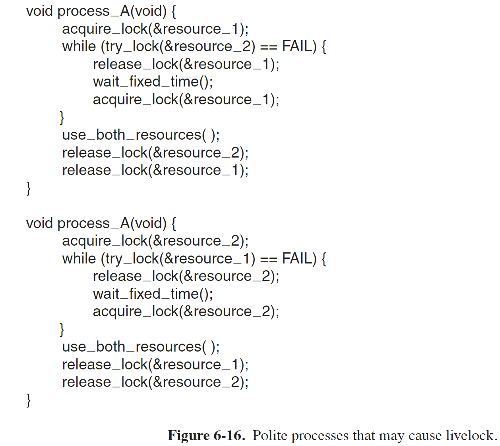

现代操作系统 第六章 死锁

# 资源
A resource is anything that must be acquired, used, and released over the course of time.

## 抢占式和非抢占式资源
A preemptable resource is one that can be taken away from the process owning it with no ill effects.

A nonpreemptable resource is one that cannot be taken away from its current owner without potentially causing failure.

In general, deadlocks involve nonpreemptable resources. 

Potential deadlocks that involve preemptable resources can usually be resolved by reallocating resources from one process to another. 

# 资源死锁
A set of processes is deadlocked if each process in the set is waiting for an event that only another process in the set can cause.

In most cases, the event that each process is waiting for is the release of some resource currently possessed by another member of the set.
This kind of deadlock is called a **resource deadlock**.

## 资源死锁的条件
> [死锁的概念](https://xiaolincoding.com/os/4_process/deadlock.html#死锁的概念)

下面四个条件必须均满足才会发生资源死锁
1. Mutual exclusion condition 
互斥条件
Each resource is either currently assigned to exactly one process or is available.
多个进程不同时使用一个资源
2. Hold-and-wait condition 
持有并等待条件
Processes currently holding resources that were granted earlier can request new resources.
如果一个进程已经持有一个资源，还可以继续申请其他资源，如果新的资源被其他进程持有，则该进程等待新资源的释放，同时继续持有旧资源
3. No-preemption condition 
非抢占条件
Resources previously granted cannot be forcibly taken away from a process. 
They must be explicitly released by the process holding them.
当一个进程已经持有某个资源，不能被强制剥夺，只能该进程自己释放其资源
4. Circular wait condition 
环路等待条件
There must be a circular list of two or more processes, each of which is waiting for a resource held by the next member of the chain.
两个或多个进程形成环路，环路中每个进程都等待环路内的下一个进程释放资源

## 死锁模型
死锁模型见下图：

方框表示资源，圆圈为进程，进程 C 等待资源 T，但资源 T 已经被进程 D 持有
进程 D 等待资源 U，但资源 U 已经被进程 C 持有
最终进程 C 和 D 都处于阻塞状态，等待对方释放资源

## 死锁检测和恢复

### 检测死锁

#### 资源分配图法
该方法将进程和资源之间的关系表示为有向图，通过遍历资源分配图，检查是否存在环路

#### 工具检测死锁

### 从死锁中恢复

#### Recovery through Preemption
In some cases it may be possible to temporarily take a resource away from its current owner and give it to another process.

#### Recovery through Rollback
If the system designers and machine operators know that deadlocks are likely, they can arrange to have processes checkpointed periodically. 
Checkpointing a process means that its state is written to a file so that it can be restarted later.

In effect, the process is reset to an earlier moment when it did not have the resource, which is now assigned to one of the deadlocked processes. 
If the restarted process tries to acquire the resource again, it will have to wait until it becomes available.

#### Recovery through Killing Processes
The crudest but simplest way to break a deadlock is to kill one or more processes.

Where possible, it is best to kill a process that can be rerun from the beginning with no ill effects.

## 避免死锁
避免死锁就要破坏前面提到的四个条件其中之一即可

### 避免环路等待
如破坏环路等待条件，让进程或线程请求资源时按照相同顺序，如：

上图左边的示例不会死锁，右边可能会导致死锁

### 采用银行家算法合理分配资源
银行家算法的目标是确保在多进程系统中资源的安全分配，以避免死锁的发生。
它通过预先评估进程对资源的请求，判断是否分配资源会导致系统进入不安全状态，从而避免可能导致死锁的资源分配。

每个进程在开始执行之前，必须声明其最大资源需求量

见上图，假设有 5 个进程，4 个资源
左边的表为当前每个进程已经分配的资源，右边的表为每个进程还需要的资源（进程执行前已经声明其最大需求量）
右边的 E 表示已存在的资源，根据括号中的数字可知从左到右的四个资源总共数量分别为 6 3 4 2
右边的 P 表示已经持有的资源数量
右边的 A 表示还可以获取的资源数量

检查状态是否安全：
1. 检查某一行，根据右边的表查看该进程还需要的资源是否均小于或等于vector A 中的资源数量
如进程 A 对四个资源还需要的数量分别为 1 1 0 0，而四个资源还可以获取的数量分别为 1 0 2 0，可知第二个资源不足
如果所有行都不满足条件，即该行的全部资源都小于等于vector A 中的数量，则系统最终将可能出现死锁

2. 如果某个进程已经请求完所有资源并退出，则将该进程标记为终止，并将其所有资源加入vector A 中

3. 重复步骤 1 和 2 直到所有进程被标记为终止

### 设置超时机制Two-Phase Locking
设置超时机制破坏持有并等待条件

# 两阶段锁定 Two-Phase Locking
双阶段锁定是一种并发控制机制，用于管理并行访问共享资源的事务。
它基于锁的概念，在事务执行过程中采用两个阶段的锁定操作，以确保事务的隔离性和一致性。

第一阶段，进程一次获取其所需要的全部锁，如果某个锁被其他资源持有，则该进程等待锁释放
第二阶段，进程执行一些操作，然后释放锁，该阶段不能获取新的锁

该机制仍可能发生死锁

# 通信死锁
通信死锁（Communication Deadlock）是指在分布式系统或网络中，多个进程或通信实体由于相互等待彼此的消息或资源而陷入无法继续进行的状态。

通信死锁通常通过设置超时时间来打破
例如网络通信中，超时重传机制，不会因为未收到消息而无限等待下去

在通信系统或网络中也可能发生资源死锁：

Suppose that all the packets at router A need to go to B and all the packets at B need to go to C and all the packets at C need to go to D and all the packets at D need to go to A.  
No packet can move because there is no buffer at the other end and we have a classical resource deadlock, albeit in the middle of a communications system.

# 活锁 Livelock
一个进程在意识到无法获取下一个所需的锁时，试图通过放弃已经获取的锁来保持礼貌。
然后，它等待一毫秒的时间，然后再次尝试。
原则上，这是一种良好的做法，应该有助于检测和避免死锁。
然而，如果另一个进程在完全相同的时间做同样的事情，它们将面临两个人在街上相互让行的情况，但由于它们同时采取同样的步骤，没有任何进展是可能的。

活锁是一种特殊形式的死锁，其中进程或线程在不断尝试解决冲突时无法取得实质性进展。
在上述情况中，两个进程都试图通过礼貌地放弃锁并等待一段时间后再次尝试，但由于它们在完全相同的时间做出相同的行动，导致进程陷入循环，无法取得进展。

# 饥饿 Starvation
Starvation（饥饿）是指一个进程或线程由于无法获得所需的资源或得不到公平的调度，而长时间处于等待状态或无法继续执行的情况。
在计算机系统中，饥饿通常与资源分配或调度策略相关。

饥饿可以通过 FCFS 算法避免

# 乐观锁和悲观锁
> [5.5 什么是悲观锁、乐观锁？](https://xiaolincoding.com/os/4_process/pessim_and_optimi_lock.html)

